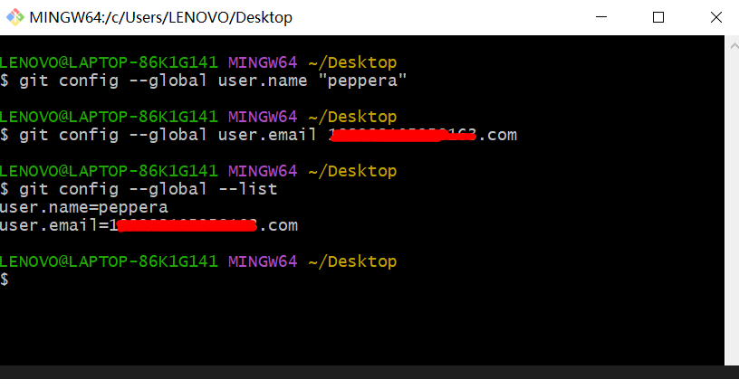
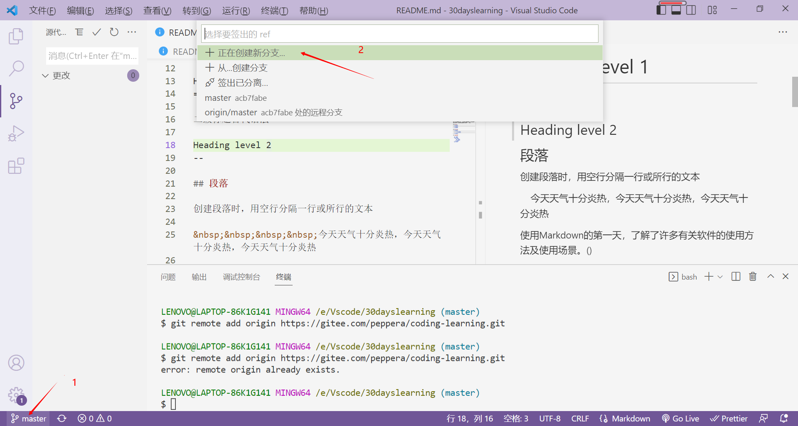

# git入门学习
 
## 一、什么是git

Git 是一个免费和开源的 分布式版本控制系统，旨在以速度和效率处理从小型到大型项目的所有内容。

## 二、git安装步骤（windows）

(一)、git下载

1. 官网下载: [https://git-scm.com/](https://git-scm.com/)

2. 点击下载

3. 查看电脑位数，选择与电脑对应得版本下载

4. 下载后点击下一步，进行安装
5. 安装成功后在电脑左面右击出现GIt Bash Here 表示安装成功
   

6. 用户信息
安装完 Git 之后，设置用户名和邮件地址。 这一点很重要，因为每一个 Git 提交都会使用这些信息，它们会写入到你的每一次提交中，不可更改：

> $ git config --global user.name "peppera"
>
> $ git config --global user.email aaaaa163.com

7. 查看用户情况

 

## (二)、注册一个gitee账号

gitee官网：[https://gitee.com/](https://gitee.com/)

1. 注册成功后点击新建仓库
   

2. 新建成功后与Vscode建里联系
   1.初始化仓库

   
   2. 配置viscode与远程仓库连接

   

## (三)、提交代码至远程仓库

1. 提交步骤如下
   
   1. 推送至云端
   
   
   2. 备注
   
   
   3.创建本地分支

   

   4. 提交成功后切换至master  
   
   

   5. 提交至远程仓库成功

   

   ## (三)、Vscode插件 GIt History Diff

   

   更加方便查看提交远程仓库历史记录

   