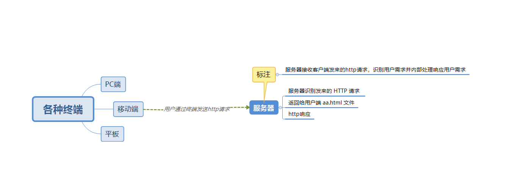
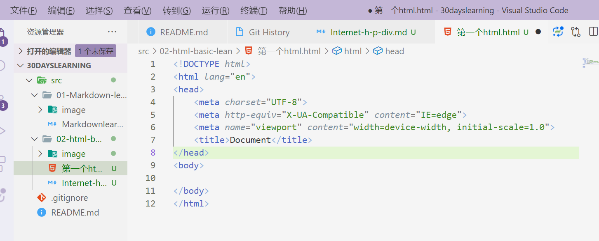

## 一、互联网基本原理

### （一）、什么是互联网，互联网基本原理？

> 互联网又称国际网络，是全世界大大小小的网络总和，网络与网络之间串联成一个庞大的网络，这些网络以一组通用的协议相连，形成逻辑上的单一巨大国际网络（类似送快递）。

### （二）、 在本地开发，在服务器共享

> 1. 程序员在本地开发
> 2. 本地开发html,css,js
> 3. 上传到服务器（共享）
> 4. 所有用户共享

### （三）、什么是服务器？

> 服务器是网络环境中的高性能计算机，它侦听网络上的其他计算机（客户机）提交的服务请求(http请求)，并提供相应的服务

### （四）、Http请求



### （五）、前后端请求交互基本流程

> 1. 用户发送http请求
> 2. 服务器端（java、Python、Node.js）等程序运行时执行数据库“增删查改”业务
> 3. 服务器端返回Http响应
> 4. 在浏览器上，Html、CSS、Js程序运行，进行结构渲染、美化、交互效果

## 二、HTML/HTML5基础语法

### 1. 创建第一个网页

1. 方法一
> 创建一个空文件夹
在文件夹中，右键新建文本文件
然后将文件后缀名.txt修改为 .html ，再使用Vscode 编辑器打开

2. 方法二

> 创建一个空文件夹，接使用 Vscode 打开文件夹
使用快捷键 Ctrl + N 新建文件 ，保存文件格式为 .html后缀名即可
或者点击新建文件按钮 或 在 Vscode 资源管理器中右键新建文件

### 2. 生成HTML5骨架

在Vscode 输入  **`!`** 按住 **`Tab`**键自动生成HTML5骨架



### 3. 查看网页方式

1. 方式一
   
> 1. 双击网页图标，即可查看
> 
> 2. 适合开发者 Chrome 浏览器，记得将 Chrome 浏览器设置为默认浏览器
> 
> 3. 修改网页内容后，在浏览器手动刷新查看修改后的效果

2. 方式二

> Vscode安装Live Server 插件后可实时查看修改后> 的内容
> 
> 安装完成后，在当前 HTML 文件中，按快捷键 `Ctrl
> +Shift+P` 选择 `Open Witch Live Server` 即
> 可打开，当修改html页面后按住`ctrl + s`查看修改后的网页效果

### 4. 常用浏览器

浏览器是网页显示、运行的平台。

> 常用浏览器有 IE、火狐（Firefox）谷（Google）
> 、Safari（苹果官方）、Opera 、Edge（微软） 等

### 4. 浏览器内核

什么时浏览器内核？

> 浏览器内核（渲染引擎）：负责读取网页内容，整理> 信息，计算网页的显示方式并显示页面

浏览器内核主要有：

| 浏览器 | 内核 | 说明 |
|    :----:   |   :----:   |   :----:   |
| IE      | Trident       |  IE 浏览器内核 |
| Edge   | WebKit        | 微软 Microsoft Edge（简称 ME 浏览器）| 
| Chrome/Opera      | Blink       |  由 Google 和 Opera Software 共同研发，Blink 其实是 WebKit 的分支，以前 Google 是 WebKit 内核、现在是 Blink |
| Firefox      | Gecko       |  火狐浏览器内核 |
| Safari      | WebKit       |  苹果浏览器内核 |
| 360、猎豹、2345 浏览器      | Trident+Blink       |  双内核 |
| UC、搜狗、遨游、QQ 浏览器      | Trident+Webkit       |  双内核 |
| 百度（已关闭）、世界之窗浏览器      | Trident       |  IE 浏览器内核 |

浏览器检测工具：<br>

[浏览器检测工具https://ie.icoa.cn/](https://ie.icoa.cn/)

## 三、 HTML5 骨架

```html
<!-- 文档声明类型 -->
<!DOCTYPE html>
<!-- <html></html> -->
<html lang="en">
  <!-- <html lang="en">声明文档语言类型为英语,lang 表示网页的语言，en表示英语，zh表示中文 ,不修改也行
    修改条件：当网站有多国语言时修改，中文版、英语版、日语版、法语版等等，具体案例可参考 小米官网源码 -->
  <head>
    <!-- <head></head>是网页的配置，不要认为是网页的头部 -->
    <meta charset="UTF-8" />
    <!-- meta 元标签，表示网页的基础配置
    charset 字符集
    UTF-8 是一种字符集 -->

    <meta http-equiv="X-UA-Compatible" content="IE=edge" />
    <meta name="viewport" content="width=device-width, initial-scale=1.0" />
    <title>Document</title>
  </head>

  <!-- <body></body> <body></body>标签对中书写网页的内容，包括网页的头部、主要内容、页脚等各个部分  -->
  <body></body>
</html>

```

### 1. 文档类型声明 DTD

#### **定义和用法**

> <!DOCTYPE> 声明必须是 HTML 文档的第一行，位于 <html> 标签之前。
> 
> <!DOCTYPE> 声明不是 HTML 标签，它
> 是指示 web 浏览器关于页面使用哪个 HTML 版本进行编写的指令。
> 在 HTML 4.01 中，<!DOCTYPE> 声明引用 DTD，因为 HTML 4.01 基于 SGML。
> 
> DTD 规定了标记语言的规则，这样浏览器才能正确地呈现内容。

#### **什么是SGML?**

> SGML（Standard Generalized Markup Language）即标准通用标记语言) SGML 是国际上定义电子文档和内容描述的标准。
> HTML5 不基于 SGML，所以不需要引用 DTD

#### **Notice**

> 请始终向 HTML 文档添加 <!DOCTYPE> 声明，这样浏览器才能获知文档类型。不写 DTD 会引发浏览器的一些兼容问题不同版本的 HTML 有不同的 DTD 写法

#### **HTML 4.01 与 HTML5 之间的差异**

> 1. 在 HTML 4.01 中有三种 <!DOCTYPE> 声明。
> 
> 2. 在 HTML5 中只有一种（如下所示）

**HTML4.01 **

```html
<!DOCTYPE html PUBLIC "-//W3C//DTD HTML 4.01//EN" "http://www.w3.org/TR/html4/strict.dtd">

```

```html

<!DOCTYPE html PUBLIC "-//W3C//DTD HTML 4.01 Transitional//EN" "http://www.w3.org/TR/html4/loose.dtd">

```
```html
<!DOCTYPE html PUBLIC "-//W3C//DTD HTML 4.01 Frameset//EN" "http://www.w3.org/TR/html4/frameset.dtd">

```

**HTML5 标准**

```html

<!DOCTYPE html>
<!--声明对大小写不敏感，以下任意方式都可以。建议使用 <!DOCTYPE html> 且由 W3C 组织制定这些版本--->

```

### **W3C 组织**
 
 > W3C 指万维网联盟（World Wide Web Consortium）是万维网的主要国际标准组织
 >
 > W3C创建于 1994 年 10 月主要负责制定 WEB 标准
> W3C 由 Tim Berners-Lee（蒂姆·伯纳斯·李） 创建 ，被誉为 "互联网之父"
> 
> W3C 是一个会员组织
> W3C 的工作是对 web 进行标准化
> W3C 创建并维护 WWW 标准W3C 标准也被称为 W3C 规范主要是 HTML 和 CSS

## 2. 网页组成

**网页主要由三部分组成：**

> 结构（Structure）、表现（Presentation）和行为（Behavior）
>
> > 结构:用于对网页元素进行整理和分类，即 HTML 也是网页的骨骼
> 
> >表现:表现用户设置网页元素的排版、颜色、大小修饰等外观样式，即 CSS,也就是网页的样式
> 
> >行为:行为是指网页模型的定义、交互等编写，即要学习的 JavaScript,及动作,行为

**Web 标准提出的最佳体验方案：**

> 结构、样式、行为相分离即：结构写在 HTML 文件中，表现写在 CSS 文件中，行为写在 JavaScript 文件中

## 3. 字符集

> meta 元标签，表示网页的基础配置
> 
> charset 字符集
> 
> UTF-8 是一种字符集,涵盖全球所有国家、民族的文字和大量图形字符,1个字符字节数为:3
> 
> gb2312（gbk）,收录所有汉字字符（简体、繁体）和英语、少量韩文、日语和少量图形字符,1个字符字节数为:2
> 
> **同样的内容，不同的编码所占字节数也不同**

## 5. 网页三要素

> title：网页的标题（30 字以内）文字会显示在浏览器的标题栏上
> 
> title 也是搜索引擎收录网站时显示的标题，为了吸引用户点击，合理的标题设置有利于 SEO 优化
> 
> keywords：网页的关键词（关键词之间用英文状态下的逗号 "," 分隔）
> description：网页的描述（150 字以内）