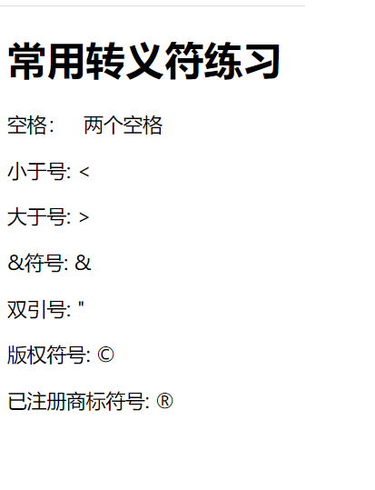
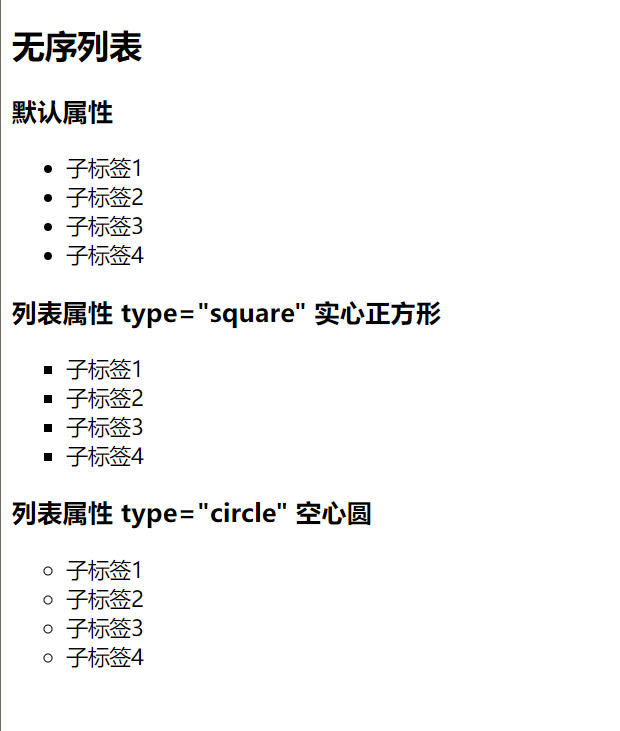

## 一、互联网基本原理

### （一）、什么是互联网，互联网基本原理？

> 互联网又称国际网络，是全世界大大小小的网络总和，网络与网络之间串联成一个庞大的网络，这些网络以一组通用的协议相连，形成逻辑上的单一巨大国际网络（类似送快递）。

### （二）、 在本地开发，在服务器共享

> 1. 程序员在本地开发
> 2. 本地开发html,css,js
> 3. 上传到服务器（共享）
> 4. 所有用户共享

### （三）、什么是服务器？

> 服务器是网络环境中的高性能计算机，它侦听网络上的其他计算机（客户机）提交的服务请求(http请求)，并提供相应的服务

### （四）、Http请求


### （五）、前后端请求交互基本流程

> 1. 用户发送http请求
> 2. 服务器端（java、Python、Node.js）等程序运行执行数据库“增删查改”业务
> 3. 服务器端返回Http响应
> 4. 在浏览器上，HTML、CSS、Js程序运行，进行结构渲染、美化、交互效果

## 二、HTML/HTML5基础语法

### 1. 创建第一个网页

1. 方法一
> 创建一个空文件夹
在文件夹中，右键新建文本文件
然后将文件后缀名.txt修改为 .html ，再使用Vscode 编辑器打开

2. 方法二

> 创建一个空文件夹，接使用 Vscode 打开文件夹
使用快捷键 Ctrl + N 新建文件 ，保存文件格式为 .html后缀名即可
或者点击新建文件按钮 或 在 Vscode 资源管理器中右键新建文件

### 2. 生成HTML5骨架

在Vscode 输入  **`!`** 按住 **`Tab`**键自动生成HTML5骨架


### 3. 查看网页方式

1. 方式一
  
> 1. 双击网页图标，即可查看
> 
> 2. 适合开发者 Chrome 浏览器，记得将 Chrome 浏览器设置为默认浏览器
> 
> 3. 修改网页内容后，在浏览器手动刷新查看修改后的效果

2. 方式二

> Vscode安装Live Server 插件后可实时查看修改后> 的内容
> 
> 安装完成后，在当前 HTML 文件中，按快捷键 `Ctrl
> +Shift+P` 选择 `Open Witch Live Server` 即
> 可打开，当修改html页面后按住`ctrl + s`查看修改后的网页效果

### 4. 常用浏览器

浏览器是网页显示、运行的平台。

> 常用浏览器有 IE、火狐（Firefox）谷（Google）
> 、Safari（苹果官方）、Opera 、Edge（微软） 等

### 4. 浏览器内核

什么时浏览器内核？

> 浏览器内核（渲染引擎）：负责对网页语法进行解释（如标准通用标记语言下的一个应用HTML、JavaScript）并渲染（显示）网页。渲染引擎决定了浏览器如何显示网页的内容以及页面的格式信息。不同的浏览器内核对网页编写语法的解释也有不同
> 
> 因此同一网页在不同的内核的浏览器里的渲染（显示）效果也可能不同。

浏览器内核主要有：

| 浏览器 | 内核 | 说明 |
|    :----:   |   :----:   |   :----:   |
| IE      | Trident       |  IE 浏览器内核 |
| Edge   | WebKit        | 微软 Microsoft Edge（简称 ME 浏览器）|
| Chrome/Opera      | Blink       |  由 Google 和 Opera Software 共同研发，Blink 其实是 WebKit 的分支，以前 Google 是 WebKit 内核、现在是 Blink |
| Firefox      | Gecko       |  火狐浏览器内核 |
| Safari      | WebKit       |  苹果浏览器内核 |
| 360、猎豹、2345 浏览器      | Trident+Blink       |  双内核 |
| UC、搜狗、遨游、QQ 浏览器      | Trident+Webkit       |  双内核 |
| 百度（已关闭）、世界之窗浏览器      | Trident       |  IE 浏览器内核 |

浏览器检测工具：<br>

[浏览器检测工具https://ie.icoa.cn/](https://ie.icoa.cn/)

## 三、 HTML5 骨架

```html
<!-- 文档声明类型 -->
<!DOCTYPE html>
<!-- <html></html> -->
<html lang="en">
  <!-- <html lang="en">声明文档语言类型为英语,lang 表示网页的语言，en表示英语，zh表示中文 ,不修改也行
    修改条件：当网站有多国语言时修改，中文版、英语版、日语版、法语版等等，具体案例可参考 小米官网源码 -->
  <head>
    <!-- <head></head>是网页的配置，不要认为是网页的头部 -->
    <meta charset="UTF-8" />
    <!-- meta 元标签，表示网页的基础配置
    charset 字符集
    UTF-8 是一种字符集 -->

    <meta http-equiv="X-UA-Compatible" content="IE=edge" />
    <meta name="viewport" content="width=device-width, initial-scale=1.0" />
    <title>Document</title>
  </head>

  <!-- <body></body> <body></body>标签对中书写网页的内容，包括网页的头部、主要内容、页脚等各个部分  -->
  <body></body>
</html>

```

### 1. 文档类型声明 DTD

#### **定义和用法**

> <!DOCTYPE> 声明必须是 HTML 文档的第一行，位于 <html> 标签之前。
> 
> <!DOCTYPE> 声明不是 HTML 标签，它是指示 web 浏览器关于页面使用哪个 HTML 版本进行编写的指令。
> 
> 在 HTML 4.01 中，<!DOCTYPE> 声明引用 DTD，因为 HTML 4.01 基于 SGML。
> 
> DTD 规定了标记语言的规则，这样浏览器才能正确地呈现内容。

#### **什么是SGML?**

> SGML（Standard Generalized Markup Language）即标准通用标记语言，SGML 是国际上定义电子文档和内容描述的标准。
> 
> HTML5 不基于 SGML，所以不需要引用 DTD

#### **Notice**

> 文档<!DOCTYPE>必须声明，这样浏览器才能获知文档类型。不写 DTD 会引发浏览器的一些 **兼容问题** 不同版本的 HTML 有不同的 DTD 写法

#### **HTML 4.01 与 HTML5 之间的差异**

> 1. 在 HTML 4.01 中有三种 <!DOCTYPE> 声明。
> 
> 2. 在 HTML5 中只有一种（如下所示）

**HTML4.01 **

```html
<!DOCTYPE html PUBLIC "-//W3C//DTD HTML 4.01//EN" "http://www.w3.org/TR/html4/strict.dtd">

```

```html

<!DOCTYPE html PUBLIC "-//W3C//DTD HTML 4.01 Transitional//EN" "http://www.w3.org/TR/html4/loose.dtd">

```
```html
<!DOCTYPE html PUBLIC "-//W3C//DTD HTML 4.01 Frameset//EN" "http://www.w3.org/TR/html4/frameset.dtd">

```

**HTML5 标准**

```html

<!DOCTYPE html>
<!--声明对大小写不敏感，以下任意方式都可以。建议使用 <!DOCTYPE html> 且由 W3C 组织制定这些版本--->

```

### 2. **W3C 组织**

 > W3C 指万维网联盟（World Wide Web Consortium）是万维网的主要国际标准组织
 >
 > W3C创建于 1994 年 10 月主要负责制定 WEB 标准， 由 Tim Berners-Lee（蒂姆·伯纳斯·李） 创建 ，被誉为 "互联网之父"
> 
> W3C 是一个会员组织主要工作是对 web 进行标准化。
> 
> W3C 创建并维护 WWW 标准，W3C 标准也被称为 W3C 规范主要是 HTML 和 CSS

### 3. 网页组成

**网页主要由三部分组成：**

> 结构（Structure）、表现（Presentation）和行为（Behavior）
>
> > 结构:用于对网页元素进行整理和分类，即 HTML 网页的骨骼
> 
> > 表现:通过设置网页元素的排版、颜色、大小修饰等外观样式，即 CSS,也就是网页的样式
> 
> > 行为:行为是指网页模型的定义、交互等编写，即JavaScript，网页的动作。

**Web 标准提出的最佳体验方案：**

> 结构、样式、行为相分离即：结构写在 HTML 文件中，表现写在 CSS 文件中，行为写在 JavaScript 文件中

### 4. 字符集

> meta 元标签，表示网页的基础配置
> 
> charset 字符集
> 
> UTF-8 是一种字符集,涵盖全球所有国家、民族的文字和大量图形字符,1个字符字节数为:3
> 
> gb2312（gbk）,收录所有汉字字符（简体、繁体）和英语、少量韩文、日语和少量图形字符,1个字符字节数为:2
> 
> **同样的内容，不同的编码所占字节数也不同**

## 四、网页三要素

> title：网页的标题（30 字以内）文字会显示在浏览器的标题栏上
> 
> title 也是搜索引擎收录网站时显示的标题，为了吸引用户点击，合理的标题设置有利于 SEO 优化
> 
> keywords：网页的关键词（关键词之间用英文状态下的逗号 "," 分隔）
> 
> description：网页的描述（150 字以内）


```html
<!-- 文档声明类型 -->
<!DOCTYPE html>
<!-- <html></html> -->
<html lang="en">
  <!-- <html lang="en">声明文档语言类型为英语,lang 表示网页的语言，en表示英语，zh表示中文 ,不修改也行
    修改条件：当网站有多国语言时修改，中文版、英语版、日语版、法语版等等，具体案例可参考 小米官网源码 -->
  <head>
    <!-- <head></head>是网页的配置，不要认为是网页的头部 -->
    <meta charset="UTF-8" />
    <!-- meta 元标签，表示网页的基础配置
    charset 字符集
    UTF-8 是一种字符集 -->

    <meta http-equiv="X-UA-Compatible" content="IE=edge" />
    <meta name="viewport" content="width=device-width, initial-scale=1.0" />
    <!-- 网页标题 -->
    <title>第一个html</title>
    <!-- 网页关键字,关键词之间用' , '隔开' -->
    <meta name="keywords" content="html,css,JavaScript,web前端" />
    <!-- 网页描述 -->
    <meta name="description" content="我的web前端学习,第一个html" />
  </head>

  <!-- <body></body> <body></body>标签对中书写网页的内容，包括网页的头部、主要内容、页脚等各个部分  -->
  <body>

  </body>
</html>

```

### SEO搜素引擎优化

**良好的书写规范有利于SEO优化**

### 什么是SEO优化?

**SEO**（Search Engine Optimization）即:**搜索引擎优化**,利用搜索引擎的规则提高网站在有关搜索引擎的自然排名.让其在行业内占据领先地位,获取品牌收益.

### SEO搜索引擎优化的好处

1. 可以提高网站在有关搜索引擎的自然排名，提高自己的网站的免费曝光度
2. 以用户为核心，为目标用户提高质量的内容。
3. 提升页面代码和网页阅读体验，对网页性能进行优化，符合搜索引擎的规则，提升搜索引擎网页的自然排名。

### 网页三要素的基础优化

1. 页面标题，30字以内
   > 网站首页：
    > 品牌词-产品中文全称，特色服务等

    ```html
      <title>品牌名-xxxx、aaaa、cccc</title>
    ```
   > list页面：
    > 产品和网站主题的概述 - `品牌词`

     ```html
      <title>xxxx、aaaa、cccc-品牌词</title>
     ```
   > detail页面
    > 具体产品或内容主题概述 - 品牌词

    ```html
      <title>xxxx、aaaa、cccc-品牌词</title>

    ```

2. 页面关键字

    > 关键字为产品名、专题名相关名词，之间用 `,` 隔开，以此告诉搜索引擎本页的重点、关键词

3. 代码顺序 标题 -> 描述 -> 关键字

### 搜索引擎的索引方式

> robot terms 是一组使用逗号 `,` 分割的值。
> 
> 通常取值有：none，noindex,nofollow,all,index,follow。确保正确的使用nofollow和index属性值。

```html
  <meta name="robots" content="index,follow" />
<!--
    all：文件将被检索，且页面上的链接可以被查询；
    none：文件将不被检索，且页面上的链接不可以被查询；
    index：文件将被检索；
    follow：页面上的链接可以被查询，告诉蜘蛛可以被追踪，传递权重；
    noindex：文件将不被检索；
    nofollow：页面上的链接不可以被查询，告诉蜘蛛无需追踪，不传递权重。一般用于站外链接。
 -->

```

### 代码解读模块

```html

    <!--IE8及以上的版本按照最新的标准去渲染-->
    <meta http-equiv="X-UA-Compatible" content="IE=edge" />
```

**X-UA-Compatible 是什么？**

> X-UA-Compatible 是 IE8 的一个专有<meta>属性, **目的是：** 告诉 IE8 采用何种 IE 版本去渲染网页，在 html 的 ><head>标签中使用，IE8 以下版本不识别
> 
> Edge 模式告诉 IE 以最高级模式渲染文档，也就是任何 IE 版本都以当前版本所支持的最高级标准模式渲染，避免版本升级造成的影响。什么版本 IE 就用什么版本的标准模式渲染。
> 
> 添加”chrome=1“ 将允许站点在使用了谷歌浏览器内嵌框架（Chrome Frame）的客户端渲染，没有使用时，则没有任何影响。

**viewport：移动端适配**

```html
 <meta name="viewport" content="width=device-width, initial-scale=1.0" />
```
> width：设置 layout viewport 的宽度
> 
> device-width ：设置成设备的实际宽度
> 
> initial-scale=1.0 ：防止浏览器对页面进行缩放 1:1 显示，即不缩放

## 五、标签

### 1. 什么是HTML？
   > HTML是用来·描述网页的一种语言
   >
   >HTML是超文本标记语言
   >
   >HTML不是编程语言，是一种`标记语言`
   >
   > 标记语言是用一套`标记标签`,来描述网页。

### 2. 超文本的含义：

> 它可以加入图片、声音、动画、多媒体等内容（也就是说超越了文本限制）

> 可以进行文件间的跳转，与世界各地的主机文件相连接（超级连接文本）

### 3. HTML标签

HTML 标记标签通常被称为 HTML 标签 (HTML tag)

> HTML 标签是由尖括号包围的关键词
> 
> HTML 标签通常是成对出现的
> 
> 标签对中的第一个标签是开始标签，第二个标签是结束标签,开始和结束标签也被称为开放标签和闭合标签

### 4. HTML 文档 = 网页

> HTML文档通常是描述网页，包含了标签和纯文本，通常被称为**网页**

> 标签主要有： 双标签和单标签;双标签是成对出现的，而单标签只有一个起始标签，结尾以`/`结尾，但**HTML5可以不用写**

## 六、HTML和HTML5常用标签及属性

### 1、标题标签 h（headline）表示 `标题` 的含义

```html
<body>
    <h1>我是一级标题</h1>
    <h2>我是二级标题</h2>
    <h3>我是三级标题</h3>
    <h4>我是四级标题</h会>
    <h5>我是五级标题</h5>
    <h6>我是六级标题</h6>
  </body>

```


**注意**

1. `<h1></h1>`标签的内容对于搜索引擎十分重要，类似于一篇文章的标题（主题）。
2. 页面中重要的内容最好放在 `<h1></h1>`标签中，提高搜索引擎搜索效率，并且 `<h1></h1>标签在网页中只能放置一个，否则会被搜索引擎视为作弊。`

### h标签在搜索引擎中优化的技巧

#### 1. 不同的类型页面的设置
   1. 首页：网站首页的 `h1` 通常是网站得logo，强调alt得内容，alt 的属性是网站首页的标题，包含核心关键词，`h2`标注分类页面， `h3`标注页面标题链接。
   2. 列表页（栏目页）：`h1`设置为分类名称， `h2`子分类名称，`h3`设置为内容和页面标题链接。
   3. 内容页（产品详情、文章页）：`h1`:文章标题名称， `h2`：标注列表名称， `h3`：标注相关文章

#### 2. h标签要包含关键词
   h标签有强调作用，所以 `h1`:必须包含核心关键词， `h2`、`h3`：适当包含长尾关键词。

#### 3. 页面标签的数量
   1个页面只能有一个`h1`标签，`h2~h6`可以没有。如果有h3就要有h2、h3。

#### 4. 标题：h1 ~ h6 标签SEO优化
  1. h1 一个页面只可有一个，首页多用于包含 logo，其他页面用于主标题
  2. h2 模块标题
  3. h3 段落的小节标题
  4. h4, h5, h6 基本上不使用

### 2、段落标签 p（Paragraph）表示 `段落` 的含义

> 任何段落都要放到 p 标签中
> p 标签中可以嵌套标签，但 `<p></p>` 标签中不能嵌套 h 标签、其他 p 标签和其他块级元素

### 3、div 标签是英语 division “分隔” 的缩写

> div 标签对是用来将相关内容组合到一起，以和其他内容分隔，使文档结构更清晰
> 
> 一般网页布局 头部，内容区，底部 都会通过 div 进行分隔
> `<div></div>` 像一个容器，什么都放进去，因此常叫div为 盒子

### 4、HTML5的特性

#### 1、空白折叠现象
> 文字和文字之间的多个空格，换行会被折叠成一个空格。
> 
> 标签内壁和文字之间的空格会被忽略。

#### 常见的转义符

| 显示结果 | 描述 | 代码书写语法|
| :---:   | :---: |  :---:  |
|         | 空格 | `&nbsp`  |
| <       | 小于号 | `&lt;`  |
| >       | 大于号 | `&gt；`  |
| &       | &符号 | `&amp;`  |
| "       | 双引号 |` &quot;`  |
| ©       | 版权 | `&copy;`  |
|®     | 已注册商标 | `&reg;`  |

```html
<body>
    <h1>常用转义符练习</h1>

    <p>空格： &nbsp;&nbsp;两个空格</p>
    <p>小于号: &lt;</p>
    <p>大于号: &gt;</p>
    <p>&符号: &amp;</p>
    <p>双引号: &quot;</p>
    <p>版权符号: &copy;</p>
    <p>已注册商标符号: &reg;</p>
  </body>

```


### 5、列表标签

#### 1、无序列表
> 无序列表标签 `<ul></ul>，是英文unordered list（不排序列表） 缩写。
> 
> 每个列表项都是 `<li></li>`标签，是英文单词 list item（列表项目）缩写
> 
> 无序列表是一个父子组合的标签，不能单独出现
> 
> `ul`的标签只能是li，`li`标签可以放任何标签。
> 
> 无序列表可以进行列表的嵌套。

```html

 <h2>无序列表</h2>
    <ul>
      <li>子标签1</li>
      <li>子标签2</li>
      <li>子标签3</li>
      <li>子标签4</li>
    </ul>

```
##### 无序列表的type属性

>无序列表的 type 属性，可以定义前导符号的样式，但在 HTML5 中已经被废弃，建议使用 CSS 替代.

| 属性 |  值  |  描述  |
|  :---: | :---: | :---: |
|  type  | disc  | 默认值，实心圆 |
|  type  |  square |  实心正方形|
|  type  |  circle |  空心圆|



> 在 HTML5 中使用 CSS 代替来定义不同类型的无序列表

```html
    <ul style="list-style-type: square">
```

##### 无序列表使用场景

> 1、导航栏
> 2、各种页面的list列表
> 3、常见网站导航栏、列表页都会使用 ul li 无序列表标签

#### 2、有序列表

> 有刻意顺序的列表就叫做 有序列表
> 有序列表使用 <ol></ol>标签，每个列表项都是<li></li>标签
> <ol>标签是英文 ordered list（排序列表） 缩写

```html

    <ol>
      <li>有序列表1</li>
      <li>有序列表2</li>
      <li>有序列表3</li>
      <li>有序列表4</li>
    </ol>
```

##### 有序列表 ol 的 type 属性

|  值  |  描述  |
 :---: | :---: |
| 1  | 数字编号（默认值） |
|  A	 |  	大写英文字母编号|
|  a |  	小写英文字母编号|
|  I |  	大写罗马数字编号|
|  i	 |  	i	|

#####  有序列表的start 属性

> start属性值必须是一个整数，制定了列表编号的起始值,且此属性的值阿拉伯数字

```html
  <h3>有序列表的start属性</h3>

    <ol type="1" start="2">
      <li>有序列表1</li>
      <li>有序列表2</li>
      <li>有序列表3</li>
      <li>有序列表4</li>
    </ol>
  ```

##### 有序列表 ol 的 reversed 属性 HTML5新增属性

> reversed 属性是一个布尔属性
> 
> 该属性指定列表中的条目是否是倒序排列的
> 
> 该属性不需要值，只需要写 reversed 单词即可

```html
<h3>有序列表的reversed属性</h3>

    <ol type="1" reversed>
      <li>有序列表1</li>
      <li>有序列表2</li>
      <li>有序列表3</li>
      <li>有序列表4</li>
    </ol>
```
#### 3、自定义列表

> 需要逐条给出定义描述的列表，就是自定义列表
> 定义列表使用 <dl></dl>标签，是英文单词definition list（定义列表） 缩写
> 
> <dt></dt>标签，是英文单词 data term（数据项）缩写
> 
> <dd></dd>标签，是英文单词 data definition (数据定义)缩写
> 
> dd 标签内容是对dt 标签的解释说明
> 
> 网页底部列表

推荐写法

```html
<h2>自定义列表</h2>

    <dl>
      <dt>服务支持</dt>
      <dd>售后政策</dd>
      <dd>关注我们</dd>
      <dd>自助服务</dd>
    </dl>

    <dl>
      <dt>售后政策</dt>
      <dd>服务支持</dd>
      <dd>关注我们</dd>
      <dd>自助服务</dd>
    </dl>
```
### 6、多媒体标签

#### 1、图片标签 img

```html
<h2>图片标签img</h2>
    
```

> img:英语单词image（图片）的缩写
> 
> src:英语单词source（来源）的缩写
> 
> 图片必须存放在项目文件夹中,并且图片只是引入到网页中，本质上没有被插入到网页中

img 标签的 alt 属性

> alt 属性是英语 alternate（代替者）缩写,可以不写
> 作用：
> > 1. 若由于某种原因无法加载图像，浏览器会在页面上显示 alt 属性中的备用文本
> > 2. 供视力不方便的用户使用的网页朗读器，也会朗读 alt 中的文本
> > 3. 对于搜索引擎优化友好，告诉搜索引擎图片的含义，利于搜索引擎爬虫抓取

img 标签的 width、height 属性

> width、height 属性设置图片宽度和高度，单位是 PX（像素），可不写
> 如果省略其中一个属性，则表示按原始比例缩放图片

```html
 
```

> 图片标签规范
> > PC 端 img 图片必须填写 src、width、height、alt 属性，统称图片标签的四要素
> > 移动端必须填写 alt 属性

**网页上支持的图片格式**

| 图片格式 | 描述 |
| :---:    |  :---:  |
| `.bmp` | Windows 画图软件默认保存的格式，位图 |
|  `.jpeg（.jpg）` |  有损压缩图片，通常用于照片显示 |
| `.png`  | 便携式网络图像，用于 logo，背景图形等。支持透明和半透明 |
| `.gif` |  动图|
| `.svg` | 矢量图片 |
| `.webp` | 最新的压缩算法，非常优秀的图片格式 |

相对路径和绝对路径

> 相对路径
> > 从当前网页出发，要找到图片的路径就叫相对路径
> 
> 绝对路径
> > 描述文件或文件夹的精准完整地址，一般使用的是相对路径 

#### 2、超级链接  a 标签

> 超级链接是网页与网页之间链接跳转的方法
> 
> <a></a>标签是英语 anchor 锚的首字母
> 
> href 属性是英语 hypertext reference （超文本引用）缩写

```html
 <a href="http://www.baidu.com" title="点击进行页面跳转">我是超链接标签</a>
```
a 标签的 title 属性用户设置鼠标的悬停文本

##### a 标签的 target 属性

| target 属性值 | 描述 |
| :---:    |  :---:  |
|_blank / blank|在新窗口中打开网页|
|_self| 默认，当前页面跳转|

```html
 <p>给图片添加超级链接：点击图片标签跳转连接</p>

    <a href="http://www.baidu.com" title="点击图片进行页面跳转">
      
    </a>
```
##### 页面锚点

> 对于很长的页面，可以对应的标签添加 id属性，将它变成页面的 "锚点"
> 
> 点击锚点时，浏览器地址栏就会出现 #id属性名称 页面就会自动滚动到锚点处
> 
> 从其他页面页面点击带#号的链接，就可以直接定位到锚点位置
> 
> 在 HTML5 中 直接使用 #top即可回到顶部，不用定义 id="top"
> ```html
> <a href="#top">回到顶部</a>
> ```

#### 3、特殊链接（下载、邮件、电话）

##### 下载链接

> 指向 exe、zip、rar、word、excel 等文件格式的链接，将自动成为下载链接

##### 邮件链接

> 邮件链接,mailto: 前缀的链接,系统会自动打开Email相关软件发送邮件

#### 电话链接

```html
<h1>特殊链接</h1>

    <h2>下载链接</h2>

    <a
      href="https://github.com/twbs/bootstrap/releases/download/v3.4.1/bootstrap-3.4.1-dist.zip"
      >zip下载</a
    ><br />

    <a href="xxx/1.doc">doc文档下载</a>

    <h2>邮件链接</h2>

    <a href="mailto:2222@qq.com">发送邮件</a>

    <h2>电话链接</h2>
    <a href="tel:1127482">点击打电话</a>
  </body>
```