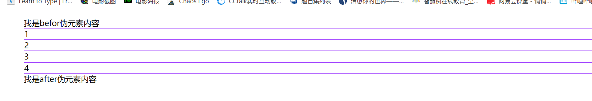

# 复合选择器+继承性-层叠性-优先级

##  复合选择器器

### 1.交集选择器

> 选择有 .box 类的 h2 标签

```html
 <style>
      /* 选择带有jiaoji类的h2标签 */
      h2.jiaoji {
        color: white;
        background-color: rgb(128, 60, 255);
      }
    </style>
  </head>
  <body>
    <h2>交际选择器1</h2>
    <h2 class="jiaoji">交际选择器2</h2>
    <h2>交际选择器3</h2>
    <h2 class="jiaoji">交际选择器4</h2>
  </body>
```


### 2.并集选择器

> 并集选择器也叫作 分组选择器，逗号表示分组，一般用于清除默标签的认样式

```html
<style>
        /* 清楚默认样式，选择器之间用逗号隔开 */
      h2,
      div,
      span,
      p,
      ul {
        margin: 0;
        padding: 0;
        list-style: none;
      }
    </style>
```


### 3.后代选择器

> 选择类名xxx 的标签内部的类名为 aaa 的标签

### 4.子代选择器

> 选中元素的直接后代（儿子元素）
> 父子间用`>`连接

```html
<style>
      /* 子代选择器-只会选择.box下的直接儿子元素p */
      .box > p {
        background-color: rgb(108, 106, 255);
      }
      /* 后代代选择器-会选择.box下的所有子孙元素p */

      .box p {
        border: 2px solid rgb(245, 153, 255);
      }
    </style>
  </head>
  <body>
    <div class="box">
      <p>box p</p>
      <div class="item">
        <p>box item p</p>
      </div>
      <p>box p</p>
    </div>
  </body>
```


### 5.相邻兄弟选择器

> 当第二个选择器紧挨着后面一个元素之后，且连个元素都属于同一个父元素的子元素，相邻兄弟选座器之间用`+`连接

```html
<style>
      /* .box里面的h3的兄弟元素p的兄弟div */
      .box h3 + p + div {
        background-color: rgb(99, 114, 245);
      }
      /* .box紧挨着的第一个兄弟元素p */
      .box + p {
        background-color: #21d291;
      }
    </style>
  </head>
  <body>
    <div class="box">
      <h3>h3</h3>
      <p>p</p>
      <div>div</div>
    </div>

    <p>p</p>
    <div class="box2">box2</div>
```


### 6.后续兄弟选座器

> 选座当前元素后面的兄弟选择器，无需紧邻，只要在同一级即可

```html
<style>
        /* 选择.box的后代元素h3元素的兄弟p，只要在同一级即可 */
      .box h3 ~ p {
        background-color: blueviolet;
      }
    </style>
  </head>
  <body>
    <div class="box">
      <h3>h3</h3>
      <p>p1</p>
      <div>div</div>
      <div>
        <p>div p</p>
      </div>
      <p>p2</p>
    </div>
```


### 7.伪类选择器

> 指定要选择的元素的特殊状态
> 比如a标签的a:link、a:visited、a:hover、a:active
> 书写时严格遵守:link -> :visited -> :hover -> :active顺序，可按照情况单独使用:hover可在其他标签上使用	

### 8.:focus获取焦点

> 当用户点击或触摸元素或通过键盘`tab`选择它会被触发
```html
<style>
      input {
        height: 30px;
        width: 280px;
      }
      input:focus {
        color: white;
        background-color: rgb(154, 81, 255);
      }
    </style>
  </head>
  <body>
    <input type="text" name="user" id="" value="获取焦点时，我的状态发生改变" />
```


### 9.:checked被选中

```html
<style>
      /* 点击添加阴影效果 */
      input:checked {
        box-shadow: 0px 0px 4px #21d291;
      }
      /* 选中隐藏 */
      /* input:checked + div {
        display: none;
      } */
      input:checked + div {
        border: 1px solid #21d291;
      }
      div {
        width: 50px;
        height: 50px;
        background-color: blueviolet;
      }
      .item {
        width: 25px;
        height: 25px;
        background-color: aquamarine;
        margin: 12px auto;
      }
      input:checked + div {
        display: block;
      }
    </style>
  </head>
  <body>
    <label for="a">
      <input type="checkbox" name="" id="a" />
      <div>
        <div class="item"></div>
      </div>
    </label>
  </body>
```

> 表示任何处于选中状态的radio、checkbox、或select的option属性


### 10.伪元素选择器

> ::before 创建一个伪元素，选中匹配中的元素的第一个子元素，通过content属性为第一个元素添加修饰性的内容，默认为行内元素。
> 
> ::after 创建一个伪元素，选中匹配中的元素的最后一个子元素，通过content属性为第一个元素添加修饰性的内容，默认为行内元素。
> css3引入::before和::after将伪类和伪元素区别开来
> 一般用于创建不需要添加任何内容的元素

```html
 ul {
        list-style: none;
      }
      ul li {
        border: 1px solid rgb(167, 79, 255);
      }
      /* 是行内元素 ，且content不能省略*/
      ul::before {
        content: "我是befor伪元素内容";
      }
      ul::after {
        content: "我是after伪元素内容";
      }
```
#### 10.1.::placeholder选择表单元素的占位文本

> 修改文本框里默认值的颜色
> input::placeholder{}



### 11.属性选择器 了解即可

### 12.序号选择器

```html
 <style>
      /* root选择器-用于选择根元素 */
      :root {
        color: rgb(84, 119, 216);
        font-size: 20px;
      }

      /* 第一个子元素,要有空格 */
      .box :first-child {
        background-color: rgb(255, 87, 87);
      }
      /* 可以和交集选择器搭配使用 */
      /* .box span:last-child {
        background-color: rgb(255, 87, 87);
      } */
      /* 最后一个子元素 */
      .box :last-child {
        background-color: rgb(87, 199, 255);
      }
      /* 第 2 个子元素 */
      .box2 :nth-child(2) {
        background-color: rgb(103, 103, 255);
      }
      /* 倒数第 2 个子元素 */
      .box2 :nth-last-child(2) {
        background-color: rgb(202, 103, 255);
      }
      ul {
        list-style: none;
        color: white;
      }
      /* 动态值写法 */
      /* 2n偶数n=2,4,6... */
      /* ul li:nth-child(-2n+6) */
      /* even */
      /* ul li:nth-child(even) */
      ul li:nth-child(2n) {
        background-color: rgb(91, 110, 255);
      }
      /* 2n+1奇数*/
      /* ul li:nth-child(-2n+5) */
      /* odd */
      /* ul li:nth-child(odd) */
      ul li:nth-child(2n + 1) {
        background-color: rgb(188, 192, 255);
      }
      /* :nth-of-type(n) 第 n 个某类型子元素 */
      /* 某种类型的第二个子元素 */
      .box3 :nth-of-type(2) {
        background-color: rgb(47, 176, 81);
      }
      /* :nth-of-type(n)动态值写法 */
      /* .box3 :nth-of-type(2n) */
      /* .box3 :nth-of-type(2n+1) */

      /* :only-child 唯一孩子*/
      .box4 :only-child {
        background-color: rgb(24, 108, 211);
      }
      .box5 p {
        height: 20px;
        border: 1px solid rgb(0, 78, 235);
      }
      /* :empty选择器 */
      /* 选择没有子元素的元素(包括元素结点文本结点和空格) */
      .box5 :empty {
        background-color: rgb(255, 15, 15);
      }
    </style>
    <title>序号选择器</title>
  </head>
  <body>
    <div class="box">
      <p>p</p>
      <h3>h3</h3>
      <div>div</div>
      <span>span</span>
    </div>
    <h2>-----------------------------------------</h2>
    <div class="box2">
      <p>p</p>
      <h3>h3</h3>
      <div>div</div>
      <span>span</span>
    </div>
    <h2>动态值写法</h2>
    <ul>
      <li>1</li>
      <li>2</li>
      <li>3</li>
      <li>4</li>
      <li>5</li>
      <li>6</li>
      <li>7</li>
      <li>8</li>
      <li>9</li>
      <li>10</li>
    </ul>
    <h2>:nth-of-type(n) 第 n 个某类型子元素</h2>
    <div class="box3">
      <div>1div</div>
      <p>2p</p>
      <div>3div</div>
      <h3>4h3</h3>
      <p>5p</p>
      <h3>6h3</h3>
    </div>

    <h2>:only-child()</h2>
    <div class="box4">
      <p>1</p>
    </div>
    <div class="box4">1111</div>
    <div class="box4">
      <p>1</p>
      <p>2</p>
    </div>

    <h2>root选择器----------------------------------</h2>
    哈哈哈哈哈哈哈哈哈
    <h2>:empty选择器</h2>
    <div class="box5">
      <p></p>
      <p><span></span></p>
      <p>1111</p>
      <p></p>
    </div>
  </body>
```

