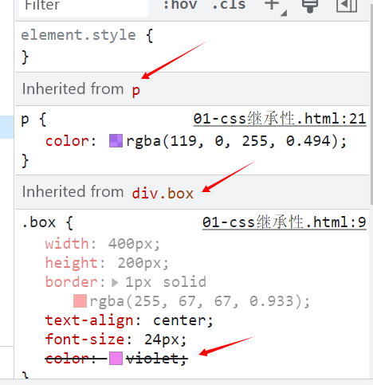

# 继承性-层叠性-优先级

## 1.css继承性

### (1).css基本概念

> css继承性：**特定**css的属性会传递给子孙元素，祖先元素设置的属性，后代会继承。
> 有的可以继承而有些不可以,width、height、border等不具备继承性;color、text-align:center等具有继承性。

### css继承性最新就近原则

> 当元素本身没有设置相关属性的时候，则会继承父元素的属性，如果父元素没有设置属性将会向上继承父元素的父元素属性，知道查找到为止，若未找到则为默认样式。

```hrml
<style>
      .box {
        /* 宽高不具有继承性 */
        width: 400px;
        height: 200px;
        /* 边框不具有继承性 */
        border: 1px solid rgba(255, 67, 67, 0.933);
        /* text-align: center;具有继承性 */
        text-align: center;
        /* 字体大小和颜色具有继承性 */
        font-size: 24px;
        color: violet;
      }
      /* span将继承p标签的颜色属性 */
      p {
        color: rgba(119, 0, 255, 0.494);
      }
    </style>
  </head>
  <body>
    <div class="box">
      <p>
        我是p标签
        <span>我是p标签里的span标签</span>
      </p>
    </div>
  </body>
```



> css属性的三个值
> > inintial 设置属性的值和浏览器默认值相同。
> > inherit 让不具有继承性的元素继承给子代。
> > unset initail和inherit的组合，若有继承性则继承给元素，若没有则默认。

### (3).可继承和不可继承的元素种类

> 可继承的属性

| 字体系列| 文本系列|列表布局|光标属性|元素可见性|
|:---:|:---:|:---:|:---:|:---:|:---:|
|font-size,fonf-family,font-style,font,font-weight|color,text-align,text-indent,word-spacing,letter-spacing,text-transform|list-style,list-style-type,list-style-image,list-style-position等|cursor|visibility控制元素显示和隐藏|

> 不可继承属性

|盒子模型|定位相关|浮动|其他|
|:---:|:---:|:---:|:---:|
|display,margin,padding,<br>  border,height,width,min-height,max-height,min-width,max-width| position,left,right,bottom,top,z-index | float,clear| background,overflow,table-layout,vertical-align,page-break-after,page-break-befor,unicode-bidi|

> a标签的color值默认是不继承的。

### (4).line-height的继承性（面试常问）

> 不同的书写方式继承值不同

|父元素line-helght的值|继承规则|子元素line-height的值|
|:---|:---|:---|
|50px| 直接继承该值| 50px|
|2| 直接继承该值| 2|
|200%| 计算百分比计算后的值，当父：font-size:20px 计算后子:40px|40px|

```html
  <style>
      .box {
        width: 400px;
        height: 50px;
        color: aliceblue;
        background-color: rgb(0, 81, 255);
        font-size: 30px;
        /* 直接继承该值 */
        line-height: 50px;
        /* 直接继承该值 2*30=60px*/
        /* line-height: 2; */
        /* 先计算百分比的值200%*30=60px */
        /* line-height: 200%; */
      }
      .item {
        /* font-size: 20px; */
        /* 1.子元素直接继承line-height:50px */
        /* 2.子元素直接继承line-height:60px */
        /* 3.子元素行高为父元素计算后的直接值 */
      }
    </style>
  </head>
  <body>
    <div class="box">
      <!-- 我是box里的值 -->
      <div class="item">我是item的值</div>
    </div>
  </body>
```

### (5).body标签样式初始化

> 在一个页面中，网页颜色、大小、字体样式等几乎一样，常用body标签对文字初始化
> 比如京东官网

```html
body{
font: 12px/1.5 Microsoft YaHei,Heiti SC,tahoma,arial,Hiragino Sans GB,"\5B8B\4F53",sans-serif;
color: #666;
}
```

## 2.css层叠性

> 层叠是一个定义怎样合并来自多个属性值的算法，是css的核心。
> 
> css层叠性解读：
> - 指多个css规则可以**同时**作用于一个标签进行样式叠加，而非覆盖。
> - css的层叠性有两层含义，分别是**叠加**和**覆盖**
> - 不同选择器作用于同一个元素时，不同属性会叠加而相同属性会覆盖
> -覆盖遵循**就近原则**和**优先级**
### 样式叠加

```html
 /* css样式规则 */
      .box1 {
        color: blueviolet;
      }
      div {
        background-color: bisque;
      }
      div.box {
        font-size: 30px;
      }
      /* 以上三个样式将会叠加 */
```

### 就近原则
> 当两个或者多个**同级别**的选择作用到同一个元素时，出现相同属性时，以**后面**选择器的属性为主。

```html
/* css层叠性的覆盖 --同级别-遵循就近原则*/
      .box2 {
        color: aqua;
      }
      .box2 {
        color: violet;
      }
      .box2 {
        color: cadetblue;
      }
```

### 优先级

> 级别不同时，两条或多条选择器作用到**同一个**元素时，出现相同属性时，以**优先级高**的为主

```html
/* css的优先级 id>class>标签选择器*/
      .box3 {
        color: coral;
      }
      div {
        color: blue;
      }
      #box3 {
        color: blueviolet;
      }
```
### 层叠性的冲突问题

> - 不同css规则作用于同一个标签,不同属性相叠加,相同覆盖
> - 相同属性覆盖,以计算后权重高的为主
> - 权重相同时,以后面的为主
> - 权重可以通过提高来达到低权重想实现的效果.

```html
<style>
      #box {
        /* id选择器优先级最高 颜色字体大小确定 */
        color: rgb(255, 161, 161);
        font-size: 30px;
      }
      .box {
        color: blue;
        /* 同级别遵循就近原则 */
        background-color: rgb(76, 162, 193);
      }
      div {
        width: 500px;
        height: 500px;
        /* 样式叠加 边框为紫色 */
        border: 2px solid rgb(145, 71, 255);
      }
      div {
        /* 同级别遵循就近原则 */

        width: 400px;
        height: 400px;
      }
    </style>
  </head>
  <body>
    <div class="box box1" id="box">我是div的内容</div>
  </body>
```

## css选择器优先级

 ### 选择器类型的权重

 > 选择器优先级权重 id选择器>class选择器>标签选择器>通配符选择器
 > 不同选择器的分数值不同,分数值越高,权重越高.

|选择器类型|选择器权重|等级|
|:---: |:---: |:---:|
|!important|无穷的|特级|
|行内样式(style属性中的样式)|1000|第一等级|
|id选择器|100|第二等级|
|class类,伪类,属性选择器|10|第三等级|
|标签选择器,伪元素选择器|1|第四等级|
|通配符选择器,子选择器,相邻选择器|0| |
|继承样式|0||