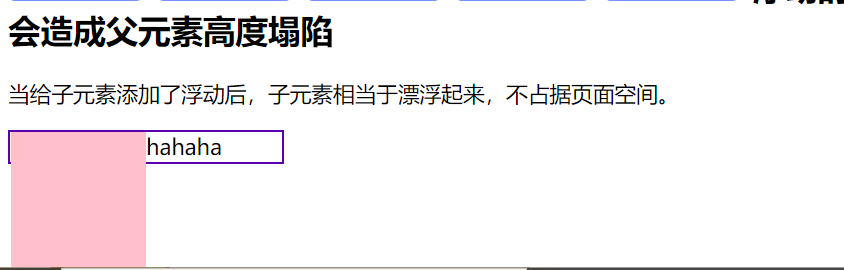

# 浮动、BFC 规范、清除浮动

## css布局类型

> 网页本质：将盒子摆放到网页的相应的位置。
> 
> 页面布局类型
> - 正常布局流
> - 浮动布局
> - 定位布局
> - 表格布局（display:table）
> - 响应式布局
> - 弹性布局
> - 网格布局
> - 多列布局

### 正常布局流

> 正常布局流：
> 不对页面进行布局控制，浏览器的默认HTML呈现的布局方式。也就是块级元素和内联元素默认的排版方式。

#### 正常布局流中，块级元素的排列方式

> 块级元素从包含块的顶部按序垂直向下排列。
> 同级盒子的垂直距离由margin决定。


#### 正常布局流中， 内联元素排版方式

> 盒子从包含块的顶部开始，按序水平排列。
> 只有水平方向有外边距和边框，内边距属性
> 盒子可以以不同的方式垂直方向对齐、底部对齐、顶部对齐和以文字底部进行对齐。

> 注意：所有的html本质上都是盒子模型，并具有盒子模型的结构与属性。
>
> 行内元素的padding-top、padding-bottom从显示的效果上是增加的，但其实设置的是无效的。并不会对他周围的元素产生任何影响。

```html
.sp1 {
        background-color: rgb(90, 210, 4);
        /* padding-top,和padding-bottom在效果上看是增加的但是实际不会对周围元素产生任何影响。 */
        padding: 10px;
      }
```


### 浮动布局

> 浮动的本意是实现页面的简单布局，实现文字环绕效果，后面float使用范围逐渐扩大。

#### float浮动的原理

> 当给元素浮动后，元素会脱离文档流，并向指定方向移动，遇到父级边界或者相邻浮动元素就会停下来，同时也会影响后面袁术的排版。

> 文档流：文档中可显示对象在页面中排列时所占有的位置
> 
> 脱离文档流：元素漂浮起来，不再占有页面空间。

#### 浮动本质

> 浮动本质是用来实现并排效果。
> 使用条件：给元素添加浮动时，并排的盒子都应该添加浮动
> 父盒子的宽度应适应子盒子的大小，否者会掉下去。


> 父元素宽度不够，子元素会掉下去


#### 浮动的值

|属性|值|
|:---:|:---|
|float|1. none默认值，不浮动 <br> 2.left 左浮动 <br> 3.right 右浮动 <br> 4.inherit 从父元素继承float值（不常用）|

```html
<style>
      /* float: left; :start */
      .box1 {
        width: 600px;
        /* 不设置高度时，父元素会塌陷 */
        height: 200px;
        border: 3px solid rgb(255, 87, 87);
      }
      .b1,
      .b2 {
        width: 200px;
        height: 200px;
        /* 不浮动默认 */
        float: none;
        /* 添加浮动使元素并排排列 */
        float: left;
      }
      .b1 {
        background-color: rgb(38, 176, 107);
      }
      .b2 {
        background-color: rgba(255, 87, 87, 0.75);
      }

      /* float: left;:end */
      /* float-right :start */
      .bb1,
      .bb2 {
        width: 200px;
        height: 200px;
        /* 添加右浮动使元素并排排列 */
        float: right;
      }
      .bb1 {
        background-color: rgb(255, 138, 138);
      }
      .bb2 {
        background-color: rgba(87, 196, 255, 0.75);
      }
      /* float-right :end */

      /* float-inherit :start */
      .box2 {
        width: 600px;
        height: 200px;
        border: 3px solid rgb(255, 87, 87);
        /* 设置左浮动 */
        float: left;
      }
      .box2 .c1,
      .box2 .c2 {
        width: 200px;
        height: 200px;
        /* 从父元素哪里继承zuofud */
        float: inherit;
      }
      .box2 .c1 {
        background-color: rgb(255, 106, 0);
      }
      .box2 .c2 {
        background-color: rgba(255, 87, 87, 0.75);
      }
      /* float-inherit :end */
    </style>
  </head>
  <body>
    <!-- float: left;start -->
    <h2>设置左浮动</h2>
    <div class="box1">
      <div class="b1"></div>
      <div class="b2"></div>
    </div>
    <!-- float: left; end -->
    <!-- float-right :start  -->
    <h2>设置右浮动</h2>
    <div class="box1">
      <div class="bb1"></div>
      <div class="bb2"></div>
    </div>
    <!-- float-right :end  -->
    <!-- float-inherit :start  -->
    <h2>inherit 规定应该从父元素继承 float 属性的值。</h2>
    <div class="box2">
      <div class="c1"></div>
      <div class="c2"></div>
    </div>
    <!-- float-inherit :end  -->
  </body>
```


#### 元素浮动的特性

1. 元素添加浮动后，脱离文档流，同时影响后面的元素，不会影响前面的元素。
2. 当父元素的宽度不够时，子元素放不下的情况下会换行。
3. 子元素会按照顺序排列，如果没有足够的空间，则会寻找在前一个兄弟元素。
4. 元素浮动后具有行内块元素的特性，不再区分块级元素和行内元素等。
5. 浮动元素会造成父元素高度的塌陷，主要原因是子元素浮动后，脱离了文档流，相当于漂浮起来，不再占据页面的空间了。
6. 浮动可以实现图片的文字环绕效果
7. 浮动可以用来实现网页布局。


> 给box2添加左浮动后,后面元素将受到影响





## BFC规范和浏览器的差异

**什么是BFC**
> BFC-> 全称会计上下文，是页面的一个隔离的独立容器
> 容器里面的子元素不会影响到外面的元素，同样外面的元素也不会影响到里面的子元素。


### BFC的创建方法

> 1. float的值不是none
> 2. position的值不是static或者relative
> 3. display的值是inline-block、flex或者inline-flex
> 4. 给父元素添加overflow:hidden;溢出盒子边框的内容将会被隐藏。
> 5. 以上几种方法中推荐使用overflow:hidden。

### BFC的作用

> 1. BFC不光能解决由浮动产生父元素的塌陷问题
> 2. BFC也可以取消盒子的margin塌陷
> 3. BFC还可以阻止元素被浮动元素覆盖的问题。

```html
 <style>
      .box {
        width: 500px;
        border: 2px solid rgb(80, 6, 177);
        /* 方法一:float 的值不是 none 
        不推荐,因为虽然可以实现效果,但是没有意义,不能随便给盒子设置浮动
        */
        /* float: left; */
        /* 方法二:position 的值不是 static 或者 relative 
        该方法虽然能实现,但不靠谱*/
        /* position: absolute; */
        /* 方法三:display 的值是 inline-block、flex 或 inline-flex
        该方法虽然能实现,但没有意义,不能随便改变盒子的行内块
        */
        /* display: inline-block; */
        /* display: flex; */
        /* display: inline-flex; */
        /* 方法三:overflow：hidden; 
        虽然可以实现效果,但不能满足所有场景
        但推荐使用该方法
        */
        overflow: hidden;
        /* 创建后BFC可以阻止元素被浮动元素覆盖 */
      }
      .box .c1,
      .c2 {
        width: 200px;
        height: 200px;
        float: left;
      }
      .box .c1 {
        background-color: aquamarine;
      }
      .box .c2 {
        background-color: rgb(127, 191, 255);
      }
      /* .box2 {
        width: 400px;
        height: 200px;
        background-color: rgb(255, 111, 154);
      } */
      .box2,
      .box3 {
        /* 创建BFC 可以取消盒子 margin 塌陷 */
        overflow: hidden;
      }
      .box2 p {
        width: 200px;
        height: 200px;
        background-color: rgb(255, 122, 122);
        float: left;
      }
      .box3 p {
        width: 200px;
        height: 200px;
        background-color: rgb(255, 122, 122);
        float: left;
      }
    </style>
  </head>
  <body>
    <h1>创建 BFC的方法</h1>
    <p>
      方法 1：float 的值不是 none <br />
      方法 2：position 的值不是 static 或者 relative <br />
      方法 3：display 的值是 inline-block、flex 或 inline-flex <br />
      方法 4：overflow：hidden;推荐使用
    </p>
    <div class="box">
      <div class="c1"></div>
      <div class="c2"></div>
    </div>
    <div class="box2">
      <p></p>
    </div>
    <div class="box3">
      <p></p>
    </div>
  </body>
```


### 浏览器差异

> IE6、7浏览器使用haslayout机制和BFC规范是有差异的
> 如果要求兼容到IE6、7网页时，尽量简化网页的布局，设置浮动的元素要设置高度height。

## 清除浮动

> **注意**：浮动一定要封闭到盒子里，否则会对页面后面的元素产生影响。

### 清除浮动的方法

> 1. 让内部有浮动盒子的父盒子形成BFC关闭内部的浮动最好使用overflow:hidden。
> 2. 给后面的父盒子设置clear: both属性，clear表示清除浮动对自己的影，clear表示左右都清除。（但不推荐使用此方法）
> 3. 使用::after伪元素给盒子添加一个最后的子元素同时也要给::afer设置clear:both。（推荐使用方式，大厂都使用该方法）
> 4. 两个盒子间通过一个带有clear:both的盒子。

```html
 <style>
      div,
      p {
        margin: 0;
        padding: 0;
      }
      /* 方法一 overflow: hidden start */
      .box {
        overflow: hidden;
        margin-bottom: 10px;
      }
      .box > p {
        width: 100px;
        height: 100px;
        background-color: rgb(255, 107, 107);
        float: left;
        margin-right: 10px;
      }
      /* 方法一 overflow: hidden end  */

      /* 方法二 overflow: clear: both; start */
      .box1 > p,
      .box2 > p {
        width: 100px;
        height: 100px;
        background-color: rgb(107, 107, 255);
        float: left;
        margin: 10px;
      }
      div.box2 {
        clear: both;
      }
      .bb {
        clear: both;
      }
      /* 方法二 overflow: clear: both; end */

      /* 方法三 ::after; start */
      .box3 {
        /* border: 2px solid rgb(213, 49, 49); */
      }
      .box3::after {
        content: "";
        clear: both;
        /* 转为块级元素 */
        display: block;
      }
      .box3 > p {
        width: 100px;
        height: 100px;
        background-color: rgb(107, 203, 255);
        float: left;
        margin: 10px;
      }
      /* 方法三 ::after; end */

      /* 方法四 两个父盒子之间 "隔墙" 隔一个携带 clear: both;的盒子 start */
      .box4 > p {
        width: 100px;
        height: 100px;
        background-color: rgb(176, 136, 255);
        float: left;
        margin: 10px;
      }
      .pp {
        clear: both;
      }
      /* 方法四 两个父盒子之间 "隔墙" 隔一个携带 clear: both;的盒子 end */
    </style>
  </head>
  <body>
    <!-- 方法一 overflow: hidden start -->
    <h1>清除浮动</h1>
    <h2>清除浮动方法 1:overflow: hidden;</h2>
    <p style="margin-bottom: 10px">
      让内部有浮动的父盒子形成 BFC，它就能关闭住内部的浮动。
      此时，最好的方法就是 overflow: hidden; 属性
    </p>
    <div class="box">
      <p></p>
      <p></p>
    </div>
    <div class="box">
      <p></p>
      <p></p>
    </div>
    <!-- 方法一 overflow: hidden end -->

    <!-- 方法二 overflow: clear: both; start -->
    <h2>清除浮动方法 2 给后面的父盒子设置 clear: both;</h2>
    <p>clear 表示清除浮动对自己的影响，both 表示左右浮动都清除</p>
    <div class="box1">
      <p></p>
      <p></p>
    </div>
    <div class="box2">
      <p></p>
      <p></p>
    </div>
    <div class="bb"></div>
    <!-- 方法二 overflow: clear: both; end -->

    <!-- 方法三 ::after; start -->
    <h2>清除浮动方法 3 使用 ::after伪元素 给盒子添加最后一个子元素</h2>
    <p>并且给 ::after 设置 clear:both;</p>
    <div class="box3">
      <p></p>
      <p></p>
    </div>
    <div class="box3">
      <p></p>
      <p></p>
    </div>
    <!-- 方法三 ::after end -->

    <!-- 方法四 在两个父盒子之间 "隔墙" 隔一个携带 clear: both;的盒子 start -->
    <h2>
      清除浮动方法 4 在两个父盒子之间 "隔墙" 隔一个携带 clear: both;的盒子
    </h2>
    <div class="box4">
      <p></p>
      <p></p>
    </div>
    <div class="pp"></div>
    <div class="box4">
      <p></p>
      <p></p>
    </div>
    <div class="pp"></div>
    <!-- 方法四 在两个父盒子之间 "隔墙" 隔一个携带 clear: both;的盒子 end -->
  </body>
```


### 浮动的使用场合

1. 左右两列式布局
2. 一行多列式布局
3. 三列式布局，中间自适应
4. 多行多列
5. 整站结构布局