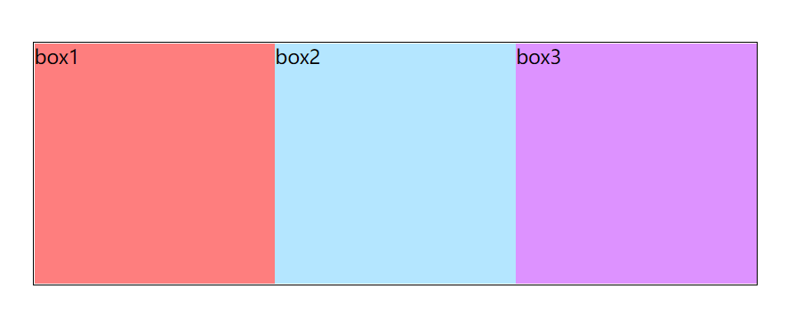
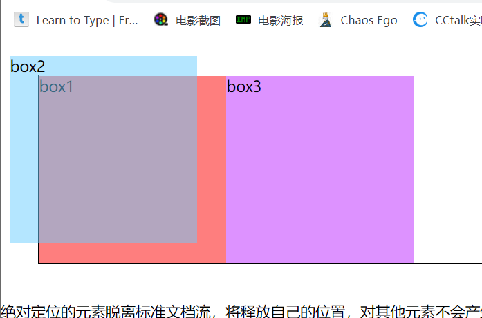

#CSS定位

**定位的类型**

|属性值|描述|
|:--:|:---:|
|static|没有定位，元素的默认值|
|relative|相对定位，相对于元素自身正常位置进行调整。|
|absolute|绝对定位，相对于最近的父元素定位，进行位置的调整。|
|fixed|固定定位，相对于浏览器窗口进行调整。|
|stick|粘性定位，基于用户滚动位置来定位|

## 相对定位

> 盒子相对自己原先的位置进行调整的叫做相对定位。
> 
> 给需要添加相对定位的元素加上position:relative；
> 
> 通过`left`、`top`、`bottom`、`right`进行相关的位置调整
> 
> 属性值可以是整数也可以是负数。

### 相对定位的特点

> 相对定位本质上还是在原来的位置，只是渲染在新地方了，但新位置不会占据空间，不会对其他元素造成影响。


### 应用场景

1. 微调元素自身的位置
2. 充当绝对定位的盒子
3. 提升自身层级

> 鼠标滑动到元素，元素少量位置偏移动画


>  网站导航


> 导航（鼠标划过带下划线）


## 绝对定位

> 盒子在浏览器中通过坐标来获得元素的绝对位置。
> 给需要绝对定位的元素加上绝对定位position：absolute
> 通过`left`、`top`、`bottom`、`right`进行相关的位置调整
> 属性值可以是正数和负数

### 绝对定位的八大特性

- 绝对定位的元素，相对离自己最近的定位元素进行调整
- 如果没有定位的父元素，就相对于body进行位置调整
- 元素完全脱离文档流，释放元素的原本位置空间
- 元素的层级提升，会覆盖在其他元素上方
- 行内元素加上定位后，具有行内块元素特性，可以设置宽高
- margin：auto水平居中失效
- 定位元素未设置宽高的情况下，同时设置top和bottom会改变元素的高，同时设置left和right会改变元素的宽
- 在元素调制宽高的情况下，同时设置top和bottom以top为主，同时设置left和right以left位置

#### 绝对定位脱离标准的文档流

> 绝对定位的元素脱离标准文档流,对其他元素不会产生任何干扰，而是对他们进行压盖
> 绝对定位的元素将会是一种漂浮状态

```html
.box2 {
        background-color: rgb(105, 205, 255, 0.5);
        /* 未设置父元素，则相对 body 进行位置调整 */
        position: absolute;
        top: 20px;
        left: 10px;
```



```html

.box {
        width: 600px;
        border: 1px solid #000;
        margin: 40px;
        position: relative;
      }
.box2 {
        background-color: rgb(105, 205, 255, 0.5);
        /* 未设置父元素，则相对 body 进行位置调整 */
        /* 设置父元素，则相对 最近的（box）父元素 进行位置调整 */
        position: absolute;
        top: 20px;
        left: 10px;
      }
```


