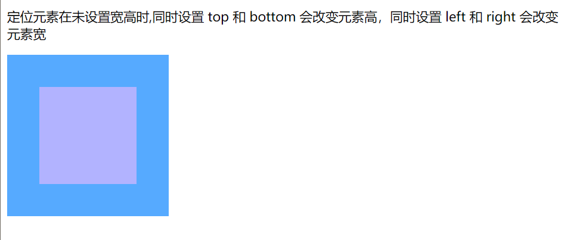
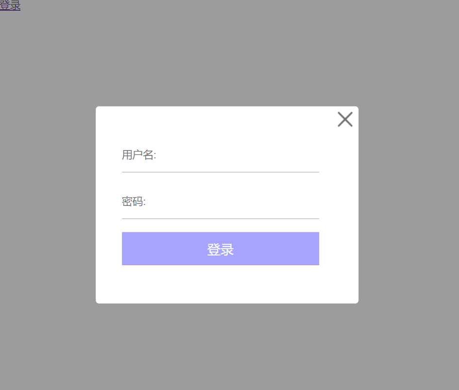

#CSS定位

**定位的类型**

|属性值|描述|
|:--:|:---:|
|static|没有定位，元素的默认值|
|relative|相对定位，相对于元素自身正常位置进行调整。|
|absolute|绝对定位，相对于最近的父元素定位，进行位置的调整。|
|fixed|固定定位，相对于浏览器窗口进行调整。|
|stick|粘性定位，基于用户滚动位置来定位|

## 相对定位

> 盒子相对自己原先的位置进行调整的叫做相对定位。
> 
> 给需要添加相对定位的元素加上position:relative；
> 
> 通过`left`、`top`、`bottom`、`right`进行相关的位置调整
> 
> 属性值可以是整数也可以是负数。

### 相对定位的特点

> 相对定位本质上还是在原来的位置，只是渲染在新地方了，但新位置不会占据空间，不会对其他元素造成影响。


### 应用场景

1. 微调元素自身的位置
2. 充当绝对定位的盒子
3. 提升自身层级

> 鼠标滑动到元素，元素少量位置偏移动画


>  网站导航


> 导航（鼠标划过带下划线）


## 绝对定位

> 盒子在浏览器中通过坐标来获得元素的绝对位置。
> 给需要绝对定位的元素加上绝对定位position：absolute
> 通过`left`、`top`、`bottom`、`right`进行相关的位置调整
> 属性值可以是正数和负数

### 绝对定位的八大特性

- 绝对定位的元素，相对离自己最近的定位元素进行调整
- 如果没有定位的父元素，就相对于body进行位置调整
- 元素完全脱离文档流，释放元素的原本位置空间
- 元素的层级提升，会覆盖在其他元素上方
- 行内元素加上定位后，具有行内块元素特性，可以设置宽高
- margin：auto水平居中失效
- 定位元素未设置宽高的情况下，同时设置top和bottom会改变元素的高，同时设置left和right会改变元素的宽
- 在元素调制宽高的情况下，同时设置top和bottom以top为主，同时设置left和right以left位置

#### 绝对定位脱离标准的文档流

> 绝对定位的元素脱离标准文档流,对其他元素不会产生任何干扰，而是对他们进行压盖
> 绝对定位的元素将会是一种漂浮状态

```html
.box2 {
        background-color: rgb(105, 205, 255, 0.5);
        /* 未设置父元素，则相对 body 进行位置调整 */
        position: absolute;
        top: 20px;
        left: 10px;
```


```html

.box {
        width: 600px;
        border: 1px solid #000;
        margin: 40px;
        position: relative;
      }
.box2 {
        background-color: rgb(105, 205, 255, 0.5);
        /* 未设置父元素，则相对 body 进行位置调整 */
        /* 设置父元素，则相对 最近的（box）父元素 进行位置调整 */
        position: absolute;
        top: 20px;
        left: 10px;
      }
```
> 设置父元素，则相对 最近的（box）父元素 进行位置调整,且绝对定位后脱离文档流，不占空间位置。


> 行内元素绝对定位后，具有行内块元素特性

```html
  /* 未添加绝对定位效果 */
      span {
        background-color: rgb(255, 100, 100);
        width: 200px;
        height: 200px;
      }
      /* 添加绝对定位效果 */
      .box > span {
        background-color: rgb(255, 100, 100);
        width: 200px;
        height: 200px;
        /* 添加绝对定位之后，具有行内块元素特性 */
        position: absolute;
      }
      .box :last-child {
        left: 230px;
      }
```


#### 绝对定位后margin:0 auto 水平居中失效

```html
.box1 {
        width: 150px;
        height: 150px;
        background-color: rgb(175, 238, 0);
        margin: 0 auto;
        /* margin:0 auto 水平居中失效 */
        position: absolute;
      }
```
> 未添加绝对定位


> 添加绝对定位后


#### 未设置宽高,top 和 bottomleft 和 right 会改变元素宽高

> 定位元素在未设置宽高时，同时设置 top 和 bottom 会改变元素高，同时设置 left 和 right 会改变元素宽
```html
 .box {
        width: 200px;
        height: 200px;
        background-color: rgb(86, 170, 255);
        position: relative;
      }
      .item {
        /* width: 80px;
    height: 80px; */
        /* 未设置宽高情况 */
        position: absolute;
        top: 40px;
        bottom: 40px;
        left: 40px;
        right: 40px;
        background-color: rgb(178, 179, 255);
      }
```


#### 设置宽高top 与 bottom,left 与 right优先级

> 在元素设置宽高情况下，同时设置 top 与 bottom，会以 top 值为主 bottom 不生效，同时设置 left 与 right，则以 left 为主，right 不生效。

```html
.item {
        width: 80px;
        height: 80px;
        /* 未设置宽高情况 */
        position: absolute;
        top: 40px;
        bottom: 100px;
        left: 40px;
        right: 200px;
        background-color: rgb(178, 179, 255);
      }
```


#### 绝对定位的盒子垂直、水平居中


```html
.box {
        width: 400px;
        height: 400px;
        background-color: rgb(24, 124, 255);
        margin: 20px auto;
        position: relative;
      }
      .item {
        width: 100px;
        height: 100px;
        margin: 10px;
        padding: 10px;
        border: 10px solid rgb(106, 210, 255);
        background-color: rgb(187, 180, 255);
        position: absolute;
        /* top=(父盒子的高 度-子盒子的占位高度)/2 */
        /* left=(父盒子的宽度-子盒子的占位宽度)/2 */
        /* top=(400-(100+20+20+20))/2 =120px*/
        top: 120px;
        left: 120px;
      }
```

>  top=(父盒子的高 度-子盒子的占位高度)/2 
> left=(父盒子的宽度-子盒子的占位宽度)/2 


#### 绝对定位使用场景

> - 用来制造压盖、遮罩效果
> - 绝对定位用来结合CSS精灵图使用
> - 绝对定位可以结合js实现动画
> ...

#### 绝对定位实现黑色半透明遮罩层

```html

  .box {
        width: 200px;
        height: 200px;
        margin: 50px auto;
        background-color: rgb(255, 61, 61);
        border: 1px solid rgb(128, 113, 255);
        /* 给父元素添加相对定位 */
        position: relative;
      }
      img {
        width: 100%;
        height: 100%;
        object-fit: cover;
      }
      /* box伪元素必须是before否者会对按钮压盖 */
      .box::before {
        display: block;
        content: "";
        /* 未设置宽高情况下，默认父元素的宽度 */
        top: 0;
        bottom: 0;
        left: 0;
        right: 0;
        /* 设置绝对定位 */
        position: absolute;
        background-color: rgba(30, 29, 29, 0.662);
        display: none;
      }
      .icon-play {
        width: 50px;
        height: 50px;
        border-radius: 50%;
        position: absolute;
        top: 75px;
        left: 75px;
        background: #fff url(./images/play.png) no-repeat 13px 9px;
        display: none;
      }
      .box:hover::before {
        display: block;
      }
      .box:hover .icon-play {
        display: block;
      }
    </style>
  </head>
  <body>
    <div class="box">
      
      <div class="icon-play"></div>
    </div>
  </body>
```


#### 绝对定位实现带三角形的会话框


```html
 <style>
      .container {
        width: 124px;
        height: 124px;
        /* background-color: rgb(191, 190, 255); */
        margin: 50px 110px;
        /* 给父元素添加相对定位 */
        position: relative;
      }
      .container img {
        display: block;
        width: 100px;
        height: 100px;
        border: 2px solid rgb(97, 117, 247);
        border-radius: 50%;
      }
      .content {
        /* 绝对定位 */
        position: absolute;
        left: 114px;
        top: -28px;
        box-sizing: border-box;
        padding: 20px;
        color: #fff;
        width: 200px;
        height: 160px;
        border-radius: 8px;
        background-color: rgb(149, 163, 252);
        display: none;
      }
      /* 三角形制作 */
      .content::after {
        width: 0;
        display: block;
        content: "";
        position: absolute;
        top: 70px;
        left: -20px;
        border: 10px solid transparent;
        border-right: 10px solid rgb(149, 163, 252);
        display: none;
      }
      /* 鼠标滑动出现的效果 */
      .container:hover .content {
        display: block;
      }
      .container:hover .content::after {
        display: block;
      }
    </style>
  </head>
  <body>
    <div class="container">
      
      <div class="content">大家好，我是花椒^_^</div>
    </div>
  </body>
```


## 固定定位

> 固定定位：
> 是给需要添加固定定位的元素加上position：fixed
> 元素位置通过`left`、`top`、`bottom`、`right`进行相关的位置调整
> 值可以是整数也可以是及负数

**注意**

> 固定定位只能以页面为参考点。
> 固定定位也会脱离标准文档流
> 除了位置是相对于浏览器窗口，其他都与绝对定位一致


```html
 body {
        padding: 0;
        margin: 0;
        height: 2000px;
      }
      .box {
        width: 400px;
        height: 300px;
        background-color: rgb(175, 169, 255);
        margin-left: 100px;
        /* 只想对于浏览器窗口 */
        position: relative;
      }
      .item {
        width: 200px;
        height: 150px;
        /* 添加固定定位 */
        position: fixed;
        /* 与浏览器顶部40px */
        top: 40px;
        /* 与浏览器左侧40px */
        left: 50px;
        background-color: rgb(180, 215, 255);
      }
    </style>
  </head>
  <body>
    <div class="box">
      <div class="item"></div>
    </div>
  </body>
```


### 固定定位的应用场景

> - 固定定位实现返回顶部
> - 常见的登录弹窗效果
> - 左右固定，中间自适应布局

> 固定定位实现返回顶部

```html
body {
        padding: 0;
        margin: 0;
        height: 2000px;
      }
      #return-top {
        width: 100%;
        height: 40px;
        line-height: 40px;
        color: white;
        font-size: 25px;
        text-align: center;
        background-color: rgb(166, 147, 255);
      }
      /* 点击返回导航栏 */
      .re {
        display: block;
        width: 50px;
        height: 50px;
        /* 添加固定定位 */
        position: fixed;
        right: 0;
        top: 500px;
        background: url(./images/return-top.png) no-repeat center;
      }
```


> 常见的登录弹窗效果

```html
 body {
        height: 2000px;
        padding: 0;
        height: 0;
      }
      input {
        margin: 0;
        padding: 0;
        border: 0;
      }
      /* mask start  */
      .mask {
        top: 0;
        bottom: 0;
        left: 0;
        right: 0;
        position: fixed;
        background-color: rgb(57, 57, 57, 0.5);
      }
      /* mask end  */

      /* login start  */
      .login {
        box-sizing: border-box;
        padding: 30px;
        /* 登录模块设置固定定位 */
        position: fixed;
        /* 在浏览器页面居中显示 */
        top: 50%;
        left: 50%;
        /* 移动自身位置的一半 */
        transform: translate(-50%, -50%);
        border-radius: 5px;
        width: 400px;
        height: 300px;
        padding-left: 40px;
        background-color: #fff;
      }
      .login input {
        width: 300px;
        height: 50px;
        margin-top: 20px;
        /* outline: none; */
        border-bottom: 1px solid rgb(161, 161, 161);
      }
      .login input::placeholder {
        font-size: 16px;
      }
      .login .login-btn > input {
        color: #fff;
        width: 300px;
        background-color: rgb(167, 164, 255);
        font-size: 20px;
      }
      /* 关闭按钮 */
      .login::after {
        display: block;
        content: "";
        width: 40px;
        height: 40px;
        background-color: rgb(191, 191, 191);
        /* 关闭符号设置绝对定位 */
        position: absolute;
        top: 0;
        right: 0;
        background: url(./images/close.png) no-repeat center;
        cursor: pointer;
      }
      /* login end  */
    </style>
  </head>
  <body>
    <a href="">登录</a>
    <!-- mask start -->
    <div class="mask"></div>
    <!-- mask end -->

    <!-- login start  -->
    <div class="login">
      <input type="text" name="" id="" placeholder="用户名:" />
      <br />
      <input type="password" name="" id="" placeholder="密码:" />
      <div class="login-btn">
        <input type="submit" value="登录" />
      </div>
    </div>
    <!-- login end -->
  </body>
```



> 左右固定，中间自适应布局

```html
<style>
      body {
        padding: 0;
        margin: 0;
        height: 2000px;
      }
      .leftbox {
        /* 固定定位 */
        position: fixed;
        top: 0;
        bottom: 0;
        left: 0;
        width: 200px;
        background-color: rgb(105, 147, 255);
      }
      .rightbox {
        /* 固定定位 */
        position: fixed;
        top: 0;
        right: 0;
        bottom: 0;
        width: 200px;
        background-color: rgb(105, 205, 255);
      }
      .middle {
        margin: 0 210px;
        /* width: 200px; */
        min-height: 700px;
        background-color: rgb(255, 94, 0);
      }
    </style>
  </head>
  <body>
    <div class="leftbox"></div>
    <div class="middle"></div>
    <div class="rightbox"></div>
  </body>
```


## 粘性定位

> 给需要添加粘性定位的元素加上position:sticky;
> 粘性定位可以看作是相对定位和固定定位的混合产物，但与上述的固定定位不同
> 当滚动高度小于元素所在位置时，元素以相对定位呈现
> 当滚动高度大于元素所在位置时，元素一固定定位呈现
> 当滚动高度大于元素的父元素底部与浏览器高时，元素相对于父元素定位，会一起走。
> 粘性定位相对于离他最近的一个拥有滚动机制的祖先元素（当该祖先的overflow 是 hidden, scroll, auto, 或 overlay时)定位 或 直接块级父元素定位。

> **固定在离自己最近的拥有“滚动机制”的祖先上**
> body 为最近“滚动机制”的祖先，此时要看到元素相对浏览器固定效果，元素的直接父元素高度一定要大于元素本身。

```html
<style>
      body {
        margin: 0;
        height: 2000px;
      }
      .top {
        height: 100px;
        background-color: pink;
      }
      .main {
        width: 1000px;
        margin: 20px auto;
        /* 这里的高度一定要大于.head元素的高度，否则看不到粘性定位效果 */
        height: 700px;
        background-color: rgb(114, 162, 250);
      }
      .head {
        height: 200px;
        background-color: rgb(240, 230, 140, 0.5);
        /* 粘性定位 */
        position: sticky;
        top: 0px;
      }
    </style>
  </head>
  <body>
    <div class="top"></div>
    <div class="main">
      <!-- 粘性定位的元素 -->
      <div class="head"></div>
    </div>
  </body>
```

> **元素的父级拥有“滚动机制”**

>当滚动父级元素的滚动条时，元素固定在父级元素的最顶部。

```html
 <style>
        body {
          margin: 0;
          height: 2000px;
        }
        .top {
          height: 100px;
          background-color: rgb(229, 192, 255);
        }
        .main {
          width: 500px;
          margin: 20px auto;
          height: 300px;
          /* 元素的父级拥有“滚动机制” */
          overflow: auto;
        }
        .head {
          height: 150px;
          background-color: rgba(85, 156, 255,.5);
          /* 粘性定位 */
          position: sticky;
          top: 0px;
        }
        .con {
          height: 700px;
          background-color: rgba(10, 180, 109);
        }
      </style>
      <body>
        <div class="top"></div>
        <div class="main">
          <div class="head">111</div>
          <div class="con">222</div>
        </div>
      </body>
```


> 头部和左侧吸顶盒效果


> 字母排序显示效果

```html
<style>
      body {
        padding: 0;
        margin: 0;
      }
      dl {
        margin: 0;
        padding: 0;
      }
      .box {
        height: 300px;
        width: 400px;
        background-color: rgb(182, 167, 255);
        color: white;
        margin: 50px auto;
        /* y轴上滚动显示 */
        overflow-y: scroll;
      }

      .box dl dt {
        height: 35px;
        line-height: 35px;
        text-indent: 2em;
        background-color: rgb(129, 62, 255);
        /* 添加粘性定位 */
        position: sticky;
        top: 0;
      }
      .box dl dt dd {
        height: 35px;
        line-height: 35px;
      }
    </style>
  </head>
  <body>
    <div class="box">
      <dl>
        <dt>A</dt>
        <dd>Andrew W.K.</dd>
        <dd>Apparat</dd>
        <dd>Arcade Fire</dd>
        <dd>At The Drive-In</dd>
        <dd>Aziz Ansari</dd>
      </dl>
      <dl>
        <dt>C</dt>
        <dd>Chromeo</dd>
        <dd>Common</dd>
        <dd>Converge</dd>
        <dd>Crystal Castles</dd>
        <dd>Cursive</dd>
      </dl>
      <dl>
        <dt>E</dt>
        <dd>Explosions In The Sky</dd>
        <dd>Explosions In The Sky</dd>
        <dd>Explosions In The Sky</dd>
        <dd>Explosions In The Sky</dd>
      </dl>
      <dl>
        <dt>T</dt>
        <dd>Ted Leo & The Pharmacists</dd>
        <dd>T-Pain</dd>
        <dd>Thrice</dd>
        <dd>TV On The Radio</dd>
        <dd>TV On The Radio</dd>
        <dd>TV On The Radio</dd>
        <dd>TV On The Radio</dd>
        <dd>TV On The Radio</dd>
        <dd>TV On The Radio</dd>
        <dd>Two Gallants</dd>
        <dd>Two Gallants</dd>
        <dd>Two Gallants</dd>
        <dd>Two Gallants</dd>
        <dd>Two Gallants</dd>
      </dl>
    </div>
  </body>
```


> 表格首行冻结

```html
<style>
      .box {
        width: 400px;
        height: 200px;
        overflow-y: scroll;
        background-color: rgb(88, 188, 255);
      }
      .box table {
        width: 100%;
        color: #fff;
        border-collapse: collapse;
      }
      .box table tr {
        text-align: center;
      }
      .box table tr th {
        position: sticky;
        top: 0;
        background-color: rgb(65, 116, 255);
      }
      .box table tr th,
      .box table tr td {
        height: 35px;

        border: 1px solid #000;
      }
      .box .t2 tr th {
        background-color: rgb(113, 65, 255);
      }
    </style>
  </head>
  <body>
    <div class="box">
      <table>
        <tr>
          <th>姓名</th>
          <th>学号</th>
          <th>成绩</th>
          <th>排名</th>
        </tr>
        <tr>
          <td>张三</td>
          <td>0001</td>
          <td>90</td>
          <td>1</td>
        </tr>
        <tr>
          <td>张四</td>
          <td>0002</td>
          <td>80</td>
          <td>2</td>
        </tr>
        <tr>
          <td>张五</td>
          <td>0003</td>
          <td>77</td>
          <td>3</td>
        </tr>
        <tr>
          <td>张六</td>
          <td>0004</td>
          <td>70</td>
          <td>4</td>
        </tr>
        <tr>
          <td>张六</td>
          <td>0004</td>
          <td>70</td>
          <td>4</td>
        </tr>
        <tr>
          <td>张六</td>
          <td>0004</td>
          <td>70</td>
          <td>4</td>
        </tr>

        <tr>
          <td>张七</td>
          <td>0005</td>
          <td>67</td>
          <td>5</td>
        </tr>
        <tr>
          <td>张八</td>
          <td>0006</td>
          <td>65</td>
          <td>6</td>
        </tr>
        <tr>
          <td>张八</td>
          <td>0006</td>
          <td>65</td>
          <td>6</td>
        </tr>
        <tr>
          <td>张八</td>
          <td>0006</td>
          <td>65</td>
          <td>6</td>
        </tr>
      </table>
      <table class="t2">
        <tr>
          <th>姓名</th>
          <th>学号</th>
          <th>成绩</th>
          <th>排名</th>
        </tr>
        <tr>
          <td>张三</td>
          <td>0001</td>
          <td>90</td>
          <td>1</td>
        </tr>
        <tr>
          <td>张四</td>
          <td>0002</td>
          <td>80</td>
          <td>2</td>
        </tr>
        <tr>
          <td>张五</td>
          <td>0003</td>
          <td>77</td>
          <td>3</td>
        </tr>
        <tr>
          <td>张六</td>
          <td>0004</td>
          <td>70</td>
          <td>4</td>
        </tr>
        <tr>
          <td>张六</td>
          <td>0004</td>
          <td>70</td>
          <td>4</td>
        </tr>
        <tr>
          <td>张六</td>
          <td>0004</td>
          <td>70</td>
          <td>4</td>
        </tr>

        <tr>
          <td>张七</td>
          <td>0005</td>
          <td>67</td>
          <td>5</td>
        </tr>
        <tr>
          <td>张八</td>
          <td>0006</td>
          <td>65</td>
          <td>6</td>
        </tr>
        <tr>
          <td>张八</td>
          <td>0006</td>
          <td>65</td>
          <td>6</td>
        </tr>
        <tr>
          <td>张八</td>
          <td>0006</td>
          <td>65</td>
          <td>6</td>
        </tr>
      </table>
    </div>
  </body>
```


> 首列冻结的效果如何实现

```html
.box table tr th {
        position: sticky;
        left: 0;
        background-color: rgb(65, 116, 255);
      }
```


## z-index 设置定位元素层叠顺序

> 定位的元素会脱离正常文档流,当多个元素都设置定位,z-index就是用来指定元素的堆叠顺序

**同一层叠上下文中 z-index值的特性**
> z-index的默认值是0
> z-index值可以是正也可以是负值
> z-index 值相同的元素后面的会覆盖前面
> z-index值越大,元素越在上
> z-index只针对定位元素有效

```html
<style>
      body {
        margin: 0;
        padding: 0;
      }
      .box {
        position: relative;
        width: 600px;
        height: 600px;
        background-color: rgb(125, 138, 255, 0.5);
      }
      .itme {
        width: 200px;
        height: 200px;
        position: absolute;
      }
      .item1 {
        background-color: rgb(227, 192, 255);
        /* z-index值越大,元素越在上 */
        /* z-index: 1; */
      }
      .item2 {
        top: 20px;
        left: 30px;
        background-color: rgb(192, 255, 251);
        /* 默认值为0 */
        /* z-index 值为负数 */
        z-index: -1;
      }
    </style>
  </head>
  <body>
    <div class="box">
      <div class="itme item1"></div>
      <div class="itme item2"></div>
    </div>
  </body>
```


> z-index 值为负数，会显示在当前层叠上下文中所有元素的最下面，因此这种方式也可以用来隐藏一个元素

