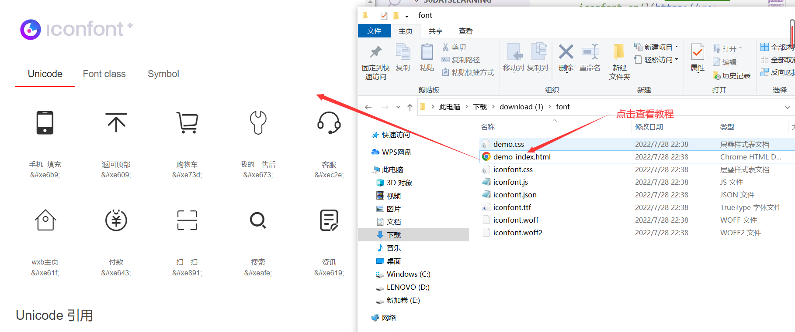
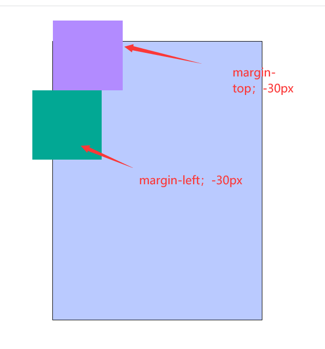
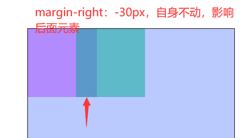

# CSS层叠上下文+iconfont+二维码生成+margin负值

## CSS 中的层叠上下文

> 层叠上下文是是HTML中的三维概念，类似于HTML的属性。
> 
> 每个 css 盒模型都是处在一个三维空间里面，他们分别处在平面的 X 轴 ，Y 轴 以及表示层叠的 Z 轴 的空间里当元素发生堆叠时，Z轴会发生覆盖的情况。
> 
> 当元素有了层叠上下文，就相当于他比网页中其它元素的级别更高了，在 Z 轴上的位置就会离我们更近，离用户（屏幕）更近了，显示在更上一层。

## 如何创建层叠上下文

> 1. html根元素：页面元素默认具有层叠上下文，叫做根层叠上下文。
> 2. z-index值为数值的**定位**元素的传统层叠上下文（但默认z-index:auto不会创建）
> 3. css3属性

**根层叠上下文**

> 页面根元素,<html>元素。
> 在 body 中的 HTML 标签，默认处在 HTMl 根层叠上下文中,在这个层叠上下文中各元素在Z 轴上有着自己的排列顺序

**定位元素的传统层叠上下文**

> position值为 fixed（固定定位）或 sticky（粘滞定位）的元素
> 
> 当给定位元素添加z-index时，元素会显示在其他元素上面，是因为元素本身拥有了自己的层叠上下文，在z轴上比其他未拥有层叠上下文高一级。

**CSS3的层叠上下文**

> z-index值不为auto的flex（display:flex或inline-flex）
> 元素的opacity的值不为1
> 元素的transform不为none
> 元素的mix-blend-mode值不是normal
> 元素的filter值不是none
> 元素的isolation值不是isolate
> will-change指定的属性值为上面的任意一个
> 元素的webkit-overflow-scrolling设为touch

**元素的层叠顺序**

> 1. 元素处于同一层级上下文，层叠顺序
> 2. 背景和边框：建里当前层叠上下文的元素的背景和边框
> 3. 负的z-index：在当前的层叠层叠上下文中，z-index为负数的元素
> 4. 块级盒子：文档中非定位后代元素
> 5. 浮动盒子：非定位浮动元素
> 6. 行内盒子：文档内非定位后代元素
> 7. z-index：0层叠级数为0的定位元素
> 8. 正z-index属性值为正的定位元素

> **注意：如果元素的等级一样，写在后面的会覆盖在前面的上方,比如块级和块级，浮动和浮动等**

**元素处在定位的层叠上下文中**

> 当相对定位处在html层叠上下文中，设置z-index：-1时，元素会在**所有**元素的最下面显示
> 当相对定位元素处在定位元素的层叠上下文中，设置z-index：-1时，元素会在**当前**层叠上下文中所有元素的最下面。

```html
.box {
        width: 200px;
        height: 200px;
        border: 4px solid rgb(0, 38, 255);
        background-color: pink;
        position: relative;
        /* 创建自己的层叠上下文 */
        /* z-index: 0; */
        /* 未设置则不会创建层叠上下文，层叠上下文是html */
      }
      .item {
        width: 200px;
        height: 200px;
        background-color: rgb(162, 184, 255);
        top: 50px;
        left: 50px;
        position: absolute;
        z-index: -1;
      }
```

> 创建自己的层叠上下文


> 未设置则不会创建层叠上下文，层叠上下文是html 


**不同层叠上下文中的子元素层叠顺序**

> 他们所在具有层叠上下文的元素的顺序决定了子元素的层叠顺序的顺序。

### 确定两个元素的的层叠顺序

> 1. 先比较他们所在的层叠上下文的顺序
> 2. 当在同一层叠上下文中，按同意层叠上下文的排列顺序计算
> 3. 当不再同一级上，，则他们所在层叠上下文的顺序决定了他们的顺序。

## iconfont字体图标库

> [字体图标库地址https://www.iconfont.cn/](https://www.iconfont.cn/)


> 参考使用步骤



> 将下载的文件拷贝到项目中

```html
 <title>字体图标</title>
    <!-- 引入字体图标样式 -->
    <link rel="stylesheet" href="./font/iconfont.css" />
    <style>
      .box {
        width: 80px;
        height: 80px;
        /* 字体图标有与文字类似的功能,可以设置颜色和大小等 */
        font-size: 60px;
        text-align: center;
        line-height: 80px;
        border: 1px solid #000;
      }
      .box:hover {
        color: rgb(135, 66, 255);
      }
    </style>
  </head>
  <body>
    <!-- 添加类名 -->
    <div class="box iconfont icon-kefu"></div>
  </body>
```


## 二维码生成器

[二维码生成器https://cli.im/](https://cli.im/)


## margin负值

### margin移动

> margin-left为负值时,元素向左移动,margin-top类同
> margin-right为负值时,自身不移动,右边元素向左移动,margin-bottom类同

```html
 background-color: rgb(178, 139, 255);
        /* margin-top: -30px; */
        float: left;
        margin-right: -30px;
      }
      .item2 {
        width: 100px;
        height: 100px;
        float: left;
        background-color: rgb(2, 168, 148, 0.5);
        /* margin-bottom: -30px; */
        /* margin-left: -30px; */
```




### margin重叠计算规则

> 兄弟元素margin重叠计算规则
> 
> 1. 全部为正值时，取最大值
> 2. 不全是正值，两者相加，取最终计算后的结果
> 3. 都为负值，取绝对值最大的那个


> 父子元素margin重叠计算规则
>
> 都为负值时取绝对值最大的值
>
> 一正一负两者相加，取最终计算后的结果


## margin负值应用场景

> 等高布局

```html
<style>
      .contanier {
        width: 600px;
        /* height: 500px; */
        overflow: hidden;
        border: 1px solid #000;
        background-color: rgb(255, 229, 229);
      }
      .leftbox {
        width: 200px;
        /* height: 500px; */
        background-color: rgb(132, 181, 255);
        float: left;
        /* 相抵消 */
        padding-bottom: 2000px;
        /* 只会影响后面的效果 */
        margin-bottom: -2000px;
      }
      .rihtbox {
        width: 300px;
        /* height: 500px; */
        background-color: rgb(212, 132, 255);
        float: right;
      }
      .clerfix::after {
        display: block;
        content: "";
        clear: both;
      }
    </style>
  </head>
  <body>
    <div class="contanier clerfix">
      <div class="leftbox">
        <ul>
          <li>li1</li>
          <li>li2</li>
          <li>li3</li>
        </ul>
      </div>
      <div class="rihtbox">
        <ul>
          <li>li1</li>
          <li>li2</li>
          <li>li3</li>
          <li>li4</li>
          <li>li5</li>
          <li>li6</li>
          <li>li7</li>
          <li>li8</li>
          <li>li9</li>
          <li>li10</li>
          <li>li10</li>
          <li>li10</li>
          <li>li10</li>
          <li>li10</li>
        </ul>
      </div>
    </div>
  </body>
```


> 一行多列

```html
 <style>
      body {
        margin: 0;
        padding: 0;
      }
      ul {
        list-style: none;
        padding: 0;
        margin: 0;
      }
      .box {
        width: 700px;
        margin: 100px auto;
        /* background-color: rgb(255, 82, 82); */
      }
      .box ul li {
        width: 100px;
        height: 100px;
        border: 1px solid #000;
        /* background-color: rgb(160, 109, 255); */
        float: left;
        /* 使用margin负值 */
        margin-left: -1px;
        /* border-left: 0; */
      }
      /* 传统设计给ul加上左边框 */
      .box ul {
        width: 505px;
        /* background-color: rgb(255, 101, 101); */
        padding-left: 1px;
        /* border-left: 1px solid #000; */
      }
      .clerfix::after {
        display: block;
        content: "";
        clear: both;
      }
    </style>
  </head>
  <body>
    <div class="box">
      <ul class="clerfix">
        <li>1</li>
        <li>2</li>
        <li>3</li>
        <li>4</li>
        <li>5</li>
      </ul>
    </div>
  </body>
```


> 头相叠加

```html
<style>
      body {
        margin: 0;
        padding: 0;
      }
      .box {
        height: 100px;
        font-size: 0;
        /* background-color: rgb(255, 155, 155); */
        line-height: 100px;
        text-align: center;
        border: 2px solid #000;
      }
      .box span {
        display: inline-block;
        width: 50px;
        height: 50px;
        /* 与元素的基线对齐 */
        vertical-align: middle;
        border-radius: 50%;
        border: 2px solid #fff;
        /* background-color: rgb(158, 126, 255); */
        margin-left: -20px;
      }
      .box span img {
        width: 100%;
        height: 100%;
        border-radius: 50%;
      }
    </style>
  </head>
  <body>
    <div class="box">
      <span>
        
      </span>
      <span>
        
      </span>
      <span>
        
      </span>
      <span>
        
      </span>
    </div>
  </body>
```


> 水平进度条

```html
<style>
      body {
        margin: 0;
        padding: 0;
      }
      ul {
        list-style: none;
        padding: 0;
        margin: 0;
        /* border: 1px solid #000; */
        font-size: 0;
        margin: 40px auto;
        width: 1200px;
      }
      .box ul li {
        display: inline-block;
        /* border: 1px solid #000; */
        /* 水平对齐 */
        vertical-align: middle;
      }
      /* 奇数li */
      .box ul li:nth-child(2n + 1) {
        width: 150px;
        border-top: 2px dashed #000;
      }
      /* 偶数li */
      .box ul li:nth-child(2n) {
        width: 50px;
        height: 50px;
        font-size: 18px;
        line-height: 50px;
        text-align: center;
        background-color: #ccc;
        border-radius: 50%;
      }
      .box ul li.current {
        background-color: rgb(166, 163, 255);
      }
    </style>
  </head>
  <body>
    <div class="box">
      <ul>
        <li></li>
        <li class="current">1</li>
        <li></li>
        <li>2</li>
        <li></li>
        <li>3</li>
        <li></li>
        <li>4</li>
        <li></li>
      </ul>
    </div>
  </body>
```

