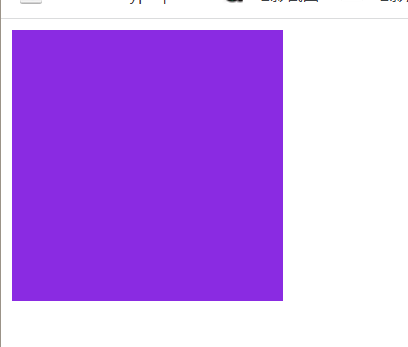
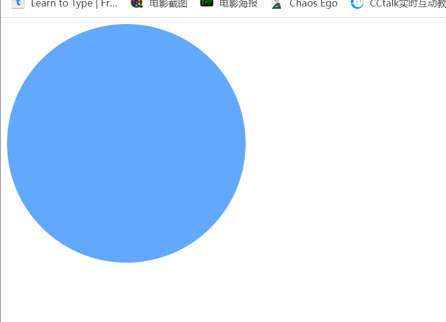

# transition过渡动画与animation自定义动画

## transition过渡动画

> transition过渡动画:一个元素由A状经过一定时间转变成B状态，而中间变化的状态会自动添加‘补间动画’
> 
> transition产生条件
> 
> > - 属性值发生变化时，会触发transition动画
> > - transition动画一般和:hover搭配使用，实现鼠标经过效果
> > - transition: transition-property transition-duration transition-timing-function transition-delay

|属性|描述|
|:---:|:---:|
|transition-property|指定css要变化的属性|
|transition-duration|指定动画时间|
|transition-timing-function|指定变化速度|
|transition-delay|延迟时间|

### 可参与transition过渡的属性

 - **可参与过渡的属性**
|属性|描述|
|:---:|:---:|
|所有数值型的属性，都可以参与过渡的属性|width、height、left、top、border-radius、font-size、opacity等|
|背景颜色和文字颜色|background-color、color|
|所有的变形（包括2D、3D）都能过渡||

- **不可参与过渡的属性**

|不可参与过渡的属性|
|:---|
|float和position不能|
|display不能|
|font-family等也不能|
特殊属性

- **transition: all属性**

> transition: all所有属性都发生改变，不要随意使用，会引发效率问题。

- **定义多个过渡效果**

> 可以用`,`分隔开

```html
        transition: border-radius 1s ease, background-color 2s ease;
```




### 时间函数

|值|描述|
|:---|:---|
|liner|匀速|
|ease|慢-快-慢|
|ease-in|以慢速开始的过渡|
|ease-out|以慢速结束的过渡效果|
|ease-in-out|以慢开始和结束|
|cubic-bezier(n,n,n)|自定义值|

> 贝塞尔曲线

 [贝塞尔曲线https://cubic-bezier.com/](https://cubic-bezier.com/#.17,.67,.83,.67)

 ## 自定义动画

 > 可以自动执行
 >
 > 自定义动画过程
 > 1. 定义动画
 > 2. 调用动画

 **@keyframes关键帧**
 > 原理时从一套css样式逐渐变化成另一套css样式
 > 以百分比规定变化发生时间，中间可以有多个变化，0%开始，100%结束。也可以用from-to，但只能定义开始和结束。

```html
/* from to 关键字 */
      /* @keyframes changcolor {
        form {
          background-color: rgb(255, 71, 71);
        }
        to {
          background-color: rgb(255, 230, 0);
        }
      } */
      /* 百分比 */
      @keyframes changcolor {
        0% {
          background-color: rgb(255, 71, 71);
        }
        100% {
          background-color: rgb(255, 230, 0);
        }
      }
```

 **调用动画**

 > animation: 动画名 时间 时间函数 延迟时间 播放次数 播放方向 播放结束状态 指定动画是否正在执行或停止执行

 ### animation 动画

 |属性|说明|属性值|
 |:---|:---|:---|
 |animation-name|指定要应用自定义动画的选择器的关键帧名字|自定义动画名|
 |animation-duration|动画完成时间|1s|
 |animation-timing-function|设置动画以怎样的速度执行|  linear 直线匀速 <br> ease 慢-快-慢 <br> ease-in 慢-快 <br> ease-out 快-慢 <br> 贝塞尔曲线 <br> steps(n[步数],start[动画开始的时候第一帧动画结束的位置]/end)定义动画在开始到结束的每一帧动画经历的步数|
 |animation-delay|延迟时间|1s|
 |animation-iteration-count|定义动画播放次数| n 数值，播放n次 <br>infinite无限播放|
 |animation-direction|指定是否轮流反向播放动画|normal 正常播放，默认 <br>reverse反向播放，按步后退|
 |animation-fill-mode|规定动画不播放时（动画完成时，或动画有延迟未开始时）应用到的样式|none 默认值，执行前和结束应用的样式 <br> forward是，动画结束后鼠标停止在最后结束的状态 <br> backwards与forwards相反 <br> both动画遵循forwards和backwards规则，动画将在这两个方向上扩展动画属性|
 |animation-play-state|动画是否正在运行或暂停|paused 暂停 <br> running 正在执行|