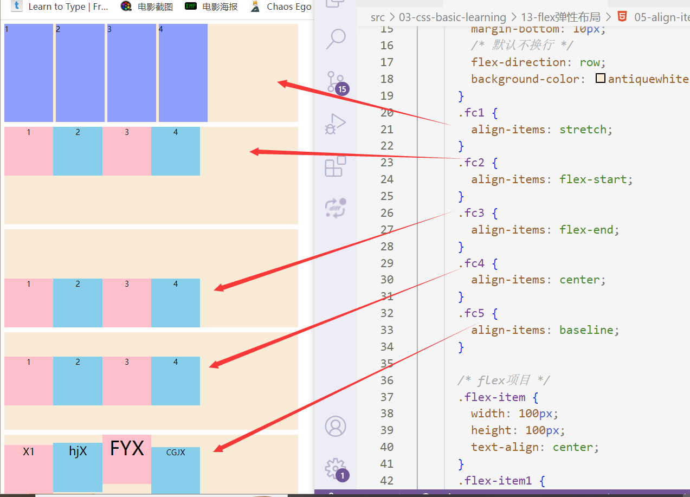

 # flex弹性布局

 ## flex弹性布局基本概念

### 什么是flex布局

 > flex全称Flexible Box，译为弹性盒子，是一种一维的布局模型，为其直接子元素直接提供强大的空间分布和对齐方式。

### 什么是flex容器，什么是flex项目

> 采用flex布局的元素，则是flex容器，而容器里面的直接子元素自动成为容器的成员，称为flex项目
>
> 通过给元素添加display:flex形成弹性布局，容器自身以块级元素呈现。
>
> 通过给元素添加display:inline-flex形成弹性布局，容器自身以行内块元素呈现。
>
> 任何盒子模型（元素）都可以设置flex布局
>
> 添加flex布局容器里的项目不再具有float、clear、vertical-align属性。


### flex容器的主轴和交叉轴

> flex容器默认存在两根轴，水平的主轴（main axis）和垂直交叉轴
> 
> 主轴开始位置叫main start，结束位置main end
> 
> 交叉轴的开始位置叫做cross start，结束位置叫做cross end
> 
> flex容器主轴默认以水平方向
> 
> 单个flex占据的主轴空间叫做main size，交叉轴空间cross size

### flex的默认属性有哪些

> flex容器默认以水平方向为主轴，垂直方向为交叉轴（flex-decoration: row）
> 
> 项目在容器里面不换行（flex-wrap:nowrap）,并排显示，当项目宽度超过容器时并排压缩
> 
> flex容器在主轴轴方向，项目宽度未设置时，默认项目的内容宽度为主，设置宽时会以当前宽度显示 
> 
> flex容器在交叉轴方向，项目高度未设置时，默认以容器宽为主 ，设置高时会以当前高度度显示 
> 
> flex-basis属性为auto时元素的宽为自动。


## flex容器属性

### 1.flex主轴方向设置(flex-decoration)

|属性值|说明|
|:---|:---|
|row|主轴在水平方向，起点在左端，交叉轴在竖直方向，默认主轴方向|
|row-reverse|主轴在水平方向，起点在最右端|
|column|主轴在垂直方向，起点在最上方，交叉轴在水平方向|
|column-reverse|主轴在垂直方向，起点在最下方|


```html
 .flex-container1 {
        flex-direction: row;
      }
      .flex-container2 {
        flex-direction: row-reverse;
      }
      .flex-container3 {
        flex-direction: column;
      }
      .flex-container4 {
        flex-direction: column-reverse;
      }
```


### flex-wrap项目主轴换行

|属性值|描述|
|:---|:---|
|nowrap|不换行（默认）|
|wrap|换行，第一行在上方|
|wrap-reverse|换行，第一行在下方|

```html
  .flex-container {
        display: flex;
        /* display: inline-flex; */
        width: 500px;
        height: 200px;
        margin-bottom: 10px;
        /* 默认不换行 */

        background-color: antiquewhite;
      }
      .fc1 {
        flex-wrap: nowrap;
      }
      .fc2 {
        flex-wrap: wrap;
      }
      .fc3 {
        flex-wrap: wrap-reverse;
      }
      /* flex项目 */
      .flex-item {
        width: 100px;
        height: 100px;
      }
```


### justify-content项目主轴上的对齐方式

|属性值|描述|
|:---|:---|
|flex-start|左对齐（默认）|
|flex-end|右对齐|
|center|居中对齐|
|space-between|两端对齐，项目之间的间隔都相等|
|space-around|每个项目的两侧间隔相等，项目之间的间隔比项目于两侧间距离大一倍|
|space-evently|每个元素之间的就离都相等|

```html
  .fc1 {
        justify-content: flex-start;
      }
      .fc2 {
        justify-content: flex-end;
      }
      .fc3 {
        justify-content: center;
      }
      .fc4 {
        justify-content: space-around;
      }
      .fc5 {
        justify-content: space-between;
      }
      .fc6 {
        justify-content: space-evenly;
      }
```


### align-items项目在交叉轴上的对齐方式(单行有效)

|属性值|描述|
|:---|:---|
|stretch|项目未设置高度或设为auto，将占满整个容器高度（默认）|
|flex-start|交叉轴起点对齐|
|flex-end|交叉轴终点对齐|
|center|交叉轴中点对齐|
|baseline|项目第一行文字的基线对齐|



### align-items项目在多轴的对齐方式(多行)

|属性值|描述|
|:---|:---|
|stretch|默认拉伸所有行来填满剩余空间（默认）|
|flex-end|交叉轴起点对齐|
|flex-end|交叉轴终点对齐|
|center|交叉轴中点对齐|
|space-between|两端对齐,轴线之间间隔平均分配|
|space-around|每个项目的两侧间隔相等，轴线之间的间隔比项目于两侧间距离大一倍|


## align-self单个项目对齐方式

|属性值|描述|
|:---|:---|
|auto|继承父级元素align-items属性，没有父元素等同于stretch（默认）|
|stretch|项目未设置高度或设为auto，将占满整个容器高度|
|flex-start|交叉轴起点对齐|
|flex-end|交叉轴终点对齐|
|center|交叉轴中点对齐|
|baseline|项目第一行文字的基线对齐|

```html
 .flex-item1{
        align-self: flex-start;
      }
      .flex-item2{
      align-self: flex-end;
      }
      .flex-item3{
        align-self: center;
      }
     
```


### flex-grow项目主轴放大系数

> flex项目的主轴尺寸的flex增长系数
> 
> flex属性在flex容器有剩余空间时才生效
> 
> 剩余空间=flex容器款大小-flex加起来的大小，flex-grow默认值为0，即使有空间也不增长
> flex-grow的值>=0
> 
> 放大后后尺寸计算公式：
> 所有项目的flex-grow值得总和加起来<1时
> > 项目放大后的宽=项目元素原始宽+（剩余空间*所有项目的flex-grow值总和）*（flex-grow）/ 所有项目的flex-grow值总和
> 
> > 所有项目的flex-grow值得总和加起来>=1时
> 项目放大后宽=项目元素宽+剩余空间*（flex-grow值）/ 所有项目的flex-grow值总和

### flex-shrink项目主轴缩放系数

> 当所有flex项目宽度之和大于容器时，才会发生收缩，主轴默认水平方向
> flex项目收缩的大小依据于所有flex项目的flex-shrink的值绝对的、
> flex-shrink默认值为1，表示容器空间不足时，所有项目等比缩小
> 只有当容器设置了flex-wrap:nowrap时，才能看到效果

**计算**
> 溢出宽=所有项目宽-容器宽
> 所有子项目缩放总宽=溢出宽*所有项目flex-shrink值之和
> 项目收缩宽=((项目原始宽*flex-shrink值)/每个项目宽*flex-shrink值之和)*所有子项目缩放总宽
> 项目缩放宽=项目原始宽-项目总收缩宽 

### flex-basis分配剩余空间前，项目占据主轴空间大小

> flex-basis 在分配剩余空间前，项目占据的主轴空间
> 浏览器根据这个属性，计算主轴是否有多余空间，默认值为auto，及项目本来的空间大小
> flex-basis的优先级高于width

### flex项目放大、缩小、空间占据

> flex是flex-grow、flex-shrink、flex-basis的缩写，默认值为0 1 auto
> flex auto表示flex：1 1 auto
> flex：none 表示flex：0 0 auto
> flex：1表示flex：flex：1 1 0% ，当没有一点剩余空间时，原素会消失