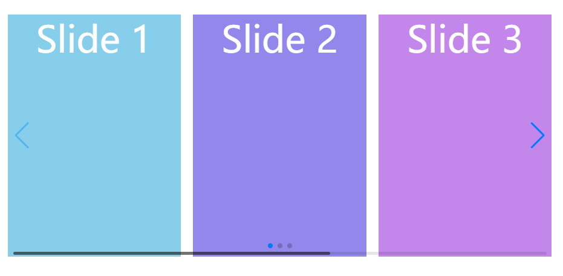
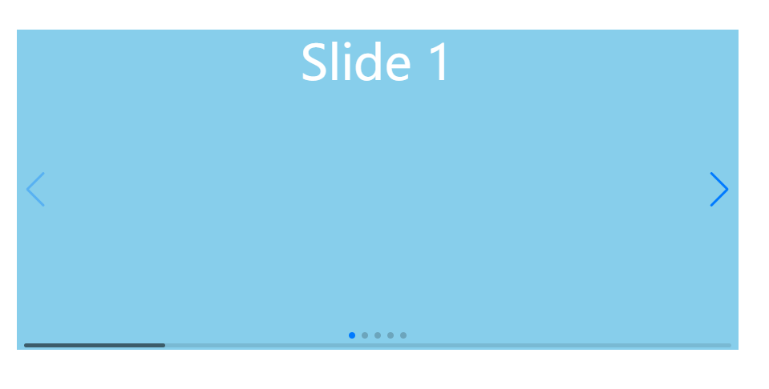
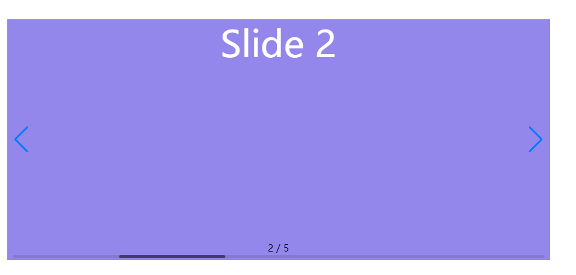
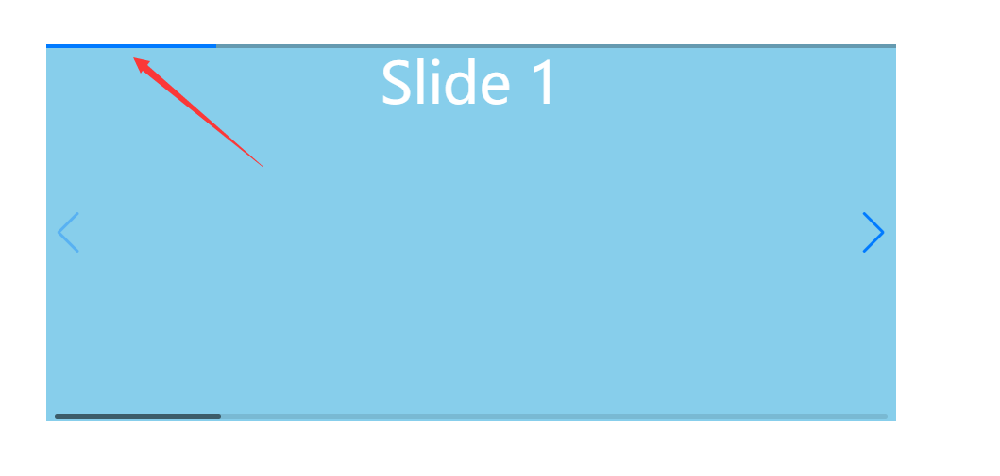

# swiper插件

## swiper 使用

> - 引入压缩后的样式文件
> - 添加HTML页面结构，Swiper7的默认容器是'.swiper'，Swiper6之前是'.swiper-container'
> - 引入js文件
> - 初始化swiper

```html
<!-- 引入css样式文件 -->
    <link rel="stylesheet" href="./css/swiper-bundle.min.css" />
    <style>
      .swiper-container {
        width: 800px;
        height: 400px;
      }
    </style>
  </head>

  <body>
    <!-- 基础结构 -->
    <div class="swiper-container">
      <div class="swiper-wrapper">
        <div class="swiper-slide">Slide 1</div>
        <div class="swiper-slide">Slide 2</div>
        <div class="swiper-slide">Slide 3</div>
      </div>
      <!-- 如果需要分页器 -->
      <div class="swiper-pagination"></div>

      <!-- 如果需要导航按钮 -->
      <div class="swiper-button-prev"></div>
      <div class="swiper-button-next"></div>

      <!-- 如果需要滚动条 -->
      <div class="swiper-scrollbar"></div>
    </div>
    <!-- 引入js文件 -->
    <script src="./js/swiper-bundle.min.js"></script>
    <!-- 初始化 -->
    <script>
      var mySwiper = new Swiper(".swiper-container", {
        direction: "vertical", // 垂直切换选项
        loop: true, // 循环模式选项

        // 如果需要分页器
        pagination: {
          el: ".swiper-pagination",
        },

        // 如果需要前进后退按钮
        navigation: {
          nextEl: ".swiper-button-next",
          prevEl: ".swiper-button-prev",
        },

        // 如果需要滚动条
        scrollbar: {
          el: ".swiper-scrollbar",
        },
      });
    </script>
```

## Swiper初始化

> 引入一swiper时使它生效便是初始化
> 
> 一个页面中引用多个Swiper，可以给每个容器加上ID或Class区分，但要保留默认的类名.swiper。
```html
 <div class="swiper-container" id="swiper1">
```

## 基础配置

### Basic-Swiper一般选项

#### initialSlide

> 设定初始化时slide的索引。Swiper默认初始化时显示第一个slide，如果想在初始化时直接显示其他slide，直接修改数值即可。
> 
> 默认值为0
> 
> initialSlide: 1,

#### direction滑动方向

> Swiper的滑动方向，水平方向切换 horizontal 或垂直方向切换 vertical 。
> 
> 默认  direction: 'horizontal',

#### speed切换速度

|配置项|描述|
|---|---|
|speed|切换速度，即slider自动滑动开始到结束的时间（单位ms），也是触摸滑动时释放至贴合的时间。<br>默认：300|

```html
 speed: 300,
```

#### grabCursor鼠标覆盖状态

|配置项|描述|
|---|---|
|grabCursor|设置为true 时，鼠标覆盖Swiper 时指针会变成手掌形状，拖动时指针会变成抓手形状。（根据浏览器形状有所不同）<br>默认：false|

```html
grabCursor: true,
```

#### breakpoints不同的响应断点

|配置项|描述|
|---|---|
|breakpoints|断点设定，允许为不同的响应断点（屏幕尺寸）设置不同的参数。类似于CSS响应式布局的media only screen and (min-width: 480px)。只有部分不需要变换布局方式和逻辑结构的参数支持断点设定，如slidesPerView、slidesPerGroup、 spaceBetween、grid.rows、slidesPerGroupSkip、direction，而像**loop、effect等则无效**。|

```html
 breakpoints: {
          320: {
            //当屏幕宽度大于等于320
            slidesPerView: 2,
            spaceBetween: 10,
          },
          768: {
            //当屏幕宽度大于等于768
            slidesPerView: 3,
            spaceBetween: 20,
          },
          1280: {
            //当屏幕宽度大于等于1280
            slidesPerView: 4,
            spaceBetween: 30,
          },
        },
```



#### Pagination 分页器

|配置项|描述|
|---|---|
|Pagination|使用分页器导航。分页器可使用小圆点样式（默认）、分式样式或进度条样式。swiper5新增可以通过设置Swiper的风格--swiper-theme-color或单独设置分页器风格--swiper-pagination-color来改变分页器颜色|
|type(类型)|‘bullets’圆点（默认）<br>'fraction分式<br>'progressbar'  进度条<br>'custom' 自定义|







```html
  pagination: {
          el: ".swiper-pagination",
          // 小圆点
          // type: "bullets",
          type: "fraction",
          // 进度条
          type: "progressbar",
          //type : 'custom',
        },
```

#### Navigation Buttons（前进后退按扭）

|配置项|描述|
|---|---|
|Navigation Buttons|使用前进后退按钮来控制Swiper切换。swiper5新增可以通过设置Swiper的风格--swiper-theme-color或单独设置按钮风格--swiper-navigation-color来改变按钮颜色。swiper5新增可以通过设置--swiper-navigation-size来调整按钮大小，默认是44px。有时你的按钮不想放在container之内，点击时可能会有蓝色的边框，加上样式outline: none 可以去除。|

```html
 navigation: {
          nextEl: ".swiper-button-next",
          prevEl: ".swiper-button-prev",
        },
```

#### Scollbar（滚动条）
|配置项|描述|
|---|---|
|Scollbar|为Swiper增加滚动条。|

```html
// 如果需要滚动条
        scrollbar: {
          el: ".swiper-scrollbar",
        },
```
#### Mousewheel(鼠标)

|配置项|描述|
|---|---|
|Mousewheel|开启鼠标滚轮控制Swiper切换。可设置鼠标选项，或true使用默认值。<br>默认：false|

```html
 mousewheel: true,
```

6、Keyboard(键盘)

|配置项|描述|
|---|---|
|Keyboard|设置开启键盘来控制Swiper切换<br>设为true时，能使用键盘的方向键控制slide切换。<br>还可以使用PageUp/PageDown键控制（4.5.1后）<br>默认：false|

```html
 keyboard: true,
        //或者
        keyboard: {
          enabled: true,
          onlyInViewport: true,
        },
```

#### Effects 切换效果

|配置项|描述|
|---|---|
|Effects（effect、fadeEffect）|**effect**设置Slide的切换效果，默认为"slide"（普通位移切换），还可设置为"fade"（淡入）、"cube"（方块）、"coverflow"（3d流）、"flip"（3d翻转）、"cards"(卡片式)、"creative"（创意性）。默认：slide<br>**fadeEffect**----fade效果参数。可选参数：crossFade。默认：false。关闭淡出。过渡时，原slide透明度为1（不淡出），过渡中的slide透明度从0->1（淡入），其他slide透明度0。可选值：true。开启淡出。过渡时，原slide透明度从1->0（淡出），过渡中的slide透明度从0->1（淡入），其他slide透明度0。|

```html
 keyboard: true,
    var mySwiper = new Swiper('#swiper1', {
    effect: 'fade',
  })
  var mySwiper2 = new Swiper('#swiper2', {
    effect: 'cube',
  })
  var mySwiper3 = new Swiper('#swiper3', {
    effect: 'coverflow',
    slidesPerView: 3,
    centeredSlides: true,
  })
  var mySwiper4 = new Swiper('#swiper4', {
    effect: 'flip',
  })
  var mySwiper5 = new Swiper('#swiper5', {
    effect: 'cards',
  })
  var mySwiper6 = new Swiper('#swiper6', {
    effect: 'creative',
    creativeEffect: {
      prev: {
        ...
      },
      next: {
        ...
      },
    },
```
      effect、fadeEffect
#### Carousel(旋转木马)
    
> slidesPerView、spaceBetween

|配置项|描述|
|---|---|
|Carousel|设置slider容器能够同时显示的slides数量(carousel模式)。<br>可以设置为数字（可为小数，小数不可loop），或者 'auto'则自动根据slides的宽度来设定数量。loop模式下如果设置为'auto'还需要设置另外一个参数loopedSlides。<br>slidesPerView: 'auto'目前还不支持多行模式（当slidesPerColumn > 1）<br>默认：1|


#### Free Mode(自由模式/撞击反弹)

|配置项|描述|
|---|---|
|Free Mode|启用自由模式功能。可设置具体参数或true来使用默认设置。<br>默认情况下Swiper 每次滑动时只滑动一个Slide，并且会自动贴合Wrapper。<br>开启自由模式后，Swiper 会根据惯性滑动可能不止一格且不会贴合。<br>默认：false|

```html
 freeMode: true,
```

#### Loop（无限循环）

|配置项|描述|
|---|---|
|loop|设置为 true 则开启循环(loop)模式。loop模式：会在原本slide 前后复制若干个slide (默认一个)并在合适的时候切换，让Swiper看起来像是循环的。 <br>复制的slide 上有一些额外的类名代表他是生成的。<br>默认：false|

```html
    loop: true,
```

#### Swiping /No swiping（禁止切换）

|配置项|描述|
|---|---|
|noSwiping|设为true时，可以在slide上（或其他元素）增加类名swiper-no-swiping'，使该slide无法拖动。例如希望文字被选中时可以考虑使用。该类名可通过 noSwipingClass 修改。<br>默认：ture|

```html
        noSwiping: true,
```

## 事件

> 在Basic（swiper一般此选项中）

- on：注册事件，Swiper4.0开始使用关键词this指代Swiper实例。
  
```html
on: {
          slideChange: function () {
            console.log(this.activeIndex);
          },
        },
```

- init：当创建一个Swiper实例时是否立即初始化。如果禁止了，可以稍后使用 `mySwiper.init()` 来初始化。
- 
```html
 var mySwiper = new Swiper(".swiper-container", {
        // 禁止初始化
        init: false,
},
var btn = document.querySelector(".btn");
      console.log(btn);
      btn.onclick = function () {
        mySwiper.init(); //现在才初始化
      };
```
> 要区分在Basic(Swiper一般选项中) 中的init与事件中的init的区别

### Events事件

- init(swiper)事件函数，初始化后执行。可选Swiper实例作为参数。
```html
        on: {
          init: function (swiper) {
            //Swiper初始化了
            console.log("当前的slide序号是" + this.activeIndex);
            //或者swiper.activeIndex，swiper与this都可指代当前swiper实例
            this.emit('transitionEnd');//在初始化时触发一次transitionEnd事件，需要先设置transitionEnd
          },
        },
```
- slideChangeTransitionStart(swiper)
- 回调函数，swiper从当前slide**开始过渡到另一个**slide时执行。
```html
on: {
    slideChangeTransitionStart: function(){
      alert(this.activeIndex);
    },
  },
```
- slideChangeTransitionEnd(swiper)
- 回调函数，swiper从一个slide过渡到另一个slide结束时执行。
- 可选Swiper实例作为参数。
```html
 on: {
    slideChangeTransitionEnd: function(){
      alert(this.activeIndex);//切换结束时，告诉我现在是第几个slide
    },
  },
```

> 如果加上loop: true,刚开始初始化swiper时会触发一次sliderTransitionStart(swiper)和  slideChangeTransitionEnd(swiper)

## Properties(Swiper属性）

- activeIndex 返回当前活动块(激活块)的索引。loop模式下注意该值会被加上复制的slide数。
- previousIndex 返回上一个活动块的索引，切换前的索引。
- realIndex 当前活动块的索引，与activeIndex不同的是，在loop模式下不会将复制的块的数量计算在内。
- width 获取swiper容器的宽度。
- height 获取swiper容器的高度。


## Methods(Swiper方法)

- mySwiper.slideNext() 滑动到下一个滑块。
- mySwiper.slidePrev() 滑动到前一个滑块。
```html
  var btn1 = document.getElementById("btn1");
      var btn2 = document.getElementById("btn2");
      console.log(btn1);
      console.log(btn2);

      btn1.onclick = function () {
        // mySwiper.init(); //现在才初始化
        mySwiper.slidePrev();
        console.log(mySwiper.activeIndex);
      };

      btn2.onclick = function () {
        // mySwiper.init(); //现在才初始化
        mySwiper.slideNext();
        console.log(mySwiper.activeIndex);
      };
```
- mySwiper.slideTo(index, speed, runCallbacks)控制Swiper切换到指定slide。
>  index 必选	指定将要切换到的slide的索引

```html
btn3.onclick = function () {
        // mySwiper.init(); //现在才初始化
        mySwiper.slideTo(1);
        console.log(mySwiper.activeIndex);
      };
```
