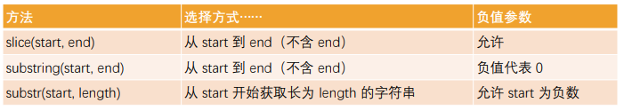

# js基本语法

## js书写位置

1. 编写位置一: 编写在html内部(了解)
2. 编写位置二: 编写在script元素之内
3. 编写位置三: 独立的js文件

## noscript

> 早期浏览器不支持 JavaScript，需要一个页面优雅降级的处理方案<noscript> 被用于给不支持 JavaScript 的浏览器提供替代内容

## 编写JavaScript注意事项

- script必须是双标签元素
-  引入, 不要在里面写内容
- type属性, 省略
- 加载顺序
- - > 作为HTML文档内容的一部分，JavaScript默认遵循HTML文档的加载顺序，即自上而下的加载顺序；推荐将JavaScript代码和编写位置放在body子元素的最后一行；
- 严格区分大小写

## 浏览器交互方式

- alert
- console.log
- document.write
- prompt


## JavaScript语句和分号

> 语句是向浏览器发出的指令，通常表达一个操作或者行为（Action）
> 通常每条语句的后面我们会添加一个分号

##  JavaScript注释的写法

- 单行注释
- 多行注释
- 文档注释
```html
    // 1.单行注释

    // 2.多行注释
    /* 
     我是一行注释
     我是另外一行注释
    */

    // 3.文档注释
    /**
     * 和某人打招呼
     * @param {string} name 姓名
     * @param {number} age 年龄
     */
```

> 注意：注释不支持嵌套

## 变量和数据类型

### 变量的理解

  - 程序中数据不断变量
  - 盒子, 存储某一个东西

### 变量的定义

- 分成两个步骤:
  - 变量声明
  - 变量赋值
- 其他的定义方法
  - 先声明, 再赋值
  - 同时声明多个变量
- 变量的命名规则
  - 字母/_/%
  - 字母/数字/_/$
  - 不能使用关键字/保留字命名
  - 严格区分大小写
- 变量的命名规范
  - 使用驼峰标识(小驼峰)
  - =左右两边家空格
  - 分号;
  - 见名知意

## 常见的数据类型

- 8种
  - String
  - Number
  - Boolean
  - Undefined 用于未初始化的值 —— 只有一个 undefined 值的独立类型。
  - Null 用于未知的值 —— 只有一个 null 值的独立类
  - Object用于更复杂的数据结构。
  - Bigint
  - Symbol

## typeof操作符

- 获取一个变量的类型
- typeof是操作符, 不是一个函数

## 数据类型

1. Number
2. String
- 单引号
- 双引号
- 反引号 ${}
- 转义字符
- 字符串补充
  - +连接
  - 长度: length
3. Boolean
- true/false
4. Undefined

- undefined
- 注意:
  - 如果一个变量声明但是没有初始化(赋值), 那么默认是undefined(不推荐)
  - 不用显示的为一个变量赋值为undefined
5. Object类型

- 复杂类型/引用类型

   ```html
    var book = {
        name: "JavaScript高级程序设置",
        price: 98
    }
   ```
6. Null类型

- 对象类型初始化时, 可以赋值为null

> null和undefined的区别

- undefined变量声明但是没有初始化(赋值), 那么默认是undefined
- null在对象初始化时会经常使用

> **JavaScript 中有八种基本的数据类型（基本数据类型，也称为原始类型，而 object 为复杂数据类型，也称为引用类
型）。**

7. String类型转换

- 隐式转换:
  - +操作, 只要有一个是字符串类型, 另外一个就会自动转成字符串类型

    var num = 123
    var numStr = num + ""

- 显示转换:
  - String()

8. Number类型转换

- 隐式转换:
  - */
- 显示转换:
  - Number()

9. Boolean类型转换

- 隐式转换:
  - 直观上为空的内容, 转成Boolean类型就是false
    - 0/""/undefined/null/NaN
  - 其他的值是true
    - 123
- 显示转换:
  - Boolean()

##  常见运算符

### 运算符/运算元
### 算术运算符
- % 取余
- ** ES7新增
### - =赋值运算符
- 原地修改
  - +=/*=
###  自增/自减
- ++/--
- 位置

### 运算符的优先级

[点击查看运算符优先级](https://developer.mozilla.org/zh-CN/docs/Web/JavaScript/Reference/Operators/Operator_Precedence)
###  比较运算符
- >
`<><=>= == !=`
> ==和===的区别
- ==: 在类型不相同的情况, 会对运算元进行隐式的转换
  - 大部分情况下, 都是转成数字类型 toNumber()
  - 对象类型相对比较特殊, 一般返回false
  - https://262.ecma-international.org/5.1/#sec-11.9.3
- ===: 先比较类型, 类型不一致, 直接返回false
  - 严格相等

> !=和!==的区别

> 与==和===类似，严格不想等`!==`


## 分支语句

### 程序的执行顺序

```html

    // 1.顺序执行
    var num1 = 10
    var num2 = 20

    var result = num1 + num2
    var result2 = num1 * num2

    // 2.分支语句
    var isLogin = true
    if (isLogin) {
      console.log("访问购物车")
      console.log("访问个人中心")
    } else { 
      console.log("跳转到登录页面")
    }

    // 3.循环语句
    var i = 0;
    while (i < 10) {
      console.log("执行循环语句")
      i++
    }
```
### 代码块
> 代码块是多行执行代码的集合，通过一个花括号{}放到了一起

### 三元运算符

`condition ? value1: value2;`

```html
 // 三元运算符
    var result = num1 > num2 ? num1: num2
    num1>num2吗，大于则执行num1,否则执行num2
    console.log(result)
```

##  逻辑运算符

### 逻辑与: &&

>  1.逻辑与: &&, 并且条件1 && 条件2 && 条件3.....
> 所有的条件都为true的时候, 最终结果才为true

### 逻辑或: ||
>    2.逻辑或: ||, 或者   条件1 || 条件2 || 条件3....
>   只要有一个条件为true, 最终结果就为true
>   案例: 如果有一门成绩大于90, 那么可以吃打1小时游戏

### 逻辑非: !, 取反

### switch

```html
   语法
    switch (表达式/变量) {
      case 常量1:
        // 语句
    }
```

## 循环语句

> JavaScript中支持三种循环方式：
- while循环；
- do..while循环；
- for循环；

### while循环的语法

- 当条件成立时，执行代码块；
- 当条件不成立时，跳出代码块；

> 如果条件一直成立（为true），那么会产生死循环。这个时候必须通过关闭页面来停止死循环；

### do..while循环

> do..while循环和while循环非常像，二者经常可以相互替代(不常用)
> 但是do..while的特点是不管条件成不成立，do循环体都会先执行一次

### for循环

```html
for (var i = 0; i < 10; i++) {
      console.log("Hello World")
    }
```
#### for循环的嵌套

> 在开发中，某些情况下一次循环是无法达到目的的，我们需要循环中嵌套循环；

#### 循环控制

> **循环的跳转**（控制）：
- 在执行循环过程中, 遇到某一个条件时, 我们可能想要做一些事情；
- 比如循环体不再执行(即使没有执行完), 跳出循环；
- 比如本次循环体不再执行, 执行下一次的循环体；
>  **循环的跳转控制**
- break: 直接跳出循环, 循环结束
- break 某一条件满足时，退出循环，不再执行后续重复的代码
- continue: 跳过本次循环次, 执行下一次循环体
- continue 指令是 break 的“轻量版”。
- continue 某一条件满足时，不执行后续重复的代码


## JavaScript函数

### 什么是函数

- 函数其实就是某段代码的封装，这段代码帮助我们完成某一个功能；
- 默认情况下JavaScript引擎或者浏览器会给我们提供一些已经实现好的函数；
- 我们也可以编写属于自己的函数；

### 函数使用的步骤

- 函数的使用包含两个步骤：
   - 声明函数 —— 封装 独立的功能
   - 调用函数 —— 享受 封装 的成果
- 声明函数，在JavaScript中也可以称为定义函数：
   - 声明函数的过程是对某些功能的封装过程；
   - 在之后的开发中，我们会根据自己的需求定义很多自己的函数；
- 调用函数，也可以称为函数调用：
   - 调用函数是让已存在的函数为我们所用；
   - 这些函数可以是刚刚自己封装好的某个功能函数；
   - 当然, 我们也可以去使用默认提供的或者其他三方库定义好的函数；
- 函数的作用：
   - 在开发程序时，使用函数可以提高编写的效率以及代码的重用；

### 声明和调用函数

> 声明函数使用function关键字：这种写法称之为函数的定义
- 注意：
  - 函数名的命名规则和前面变量名的命名规则是相同的；
  - 函数要尽量做到见名知意（并且函数通常是一些行为（action），所以使用动词会更多一些）；
- 函数定义完后里面的代码是不会执行的，函数必须调用才会执行；
- 调用函数通过函数名()即可：比如test()

### 函数的参数

- 函数的参数:
 - 函数，把 具有独立功能的代码块 组织为一个小模块，在需要的时候 调用
 - 函数的参数，增加函数的 通用性，针对 相同的数据处理逻辑，能够 适应更多的数据
   - 在函数 内部，把参数当做 变量 使用，进行需要的数据处理
   - 函数调用时，按照函数定义的参数顺序，把 希望在函数内部处理的数据，通过参数 传递
- 形参和实参
  - 形参（参数 parameter）：定义 函数时，小括号中的参数，是用来接收参数用的，在函数内部 作为变量使用
  - 实参（参数 argument）：调用 函数时，小括号中的参数，是用来把数据传递到 函数内部 用的

### arguments参数

> 在函数有一个特别的对象：arguments对象

- 默认情况下，arguments对象是所有（非箭头）函数中都可用的局部变量；
- 该对象中存放着所有的调用者传入的参数，从0位置开始，依次存放；
- arguments变量的类型是一个object类型（ array-like ），不是一个数组，但是和数组的用法看起来很相似；
- 如果调用者传入的参数多余函数接收的参数，可以通过arguments去获取所有的参数；

### 函数中调用函数

- 在开发中，函数内部是可以调用另外一个函数的
- 函数中可以可以调用自己,但是函数调用自己必须有结束条件，否则会产生无限调用，造成报错
- 函数调用自己还一个专业的名词，叫做递归

### 局部变量和外部变量

- 在JavaScript（ES5之前）中没有块级作用域的概念，但是函数可以定义自己的作用域。
  - 作用域（Scope）表示一些标识符的作用有效范围（所以也有被翻译为有效范围的）；
  - 函数的作用域表示在函数内部定义的变量，只有在**函数内部**可以被访问到；
- 外部变量和局部变量的概念：
  - 定义在函数**内部**的变量，被称之为局部变量（Local Variables）。
  - 定义在函数**外部**的变量，被称之为外部变量（Outer Variables）。
- 什么是全局变量？
  - 在**函数之外**声明的变量（在script中声明的），称之为全局变量。
  - 全局变量在任何函数中都是可见的。
  - 通过var声明的全局变量会在window对象上添加一个属性；
- 在函数中，访问变量的顺序
  - 优先访问自己函数中的变量，没有找到时，在外部中访问。

### 函数表达式

- 函数并不是一种语法结构，而是一种特殊的值
- 函数有两种方式，函数声明和函数表达式
  - 函数表达式function关键字后面没有函数名，函数表达式允许省略函数名。

### 函数声明 和 函数表达式的区别

- 语法不同：
   - 函数声明：在主代码流中声明为单独的语句的函数。
   - 函数表达式：在一个表达式中或另一个语法结构中创建的函数。
- JavaScript创建函数的时机是不同的：
   - 函数表达式是在代码执行到达时被创建，并且仅从那一刻起可用。
   - 在函数声明被定义之前，它就可以被调用。
      - 这是内部算法的原故；
      - 当 JavaScript 准备 运行脚本时，首先会在脚本中寻找全局函数声明，并创建这些函数；
- 开发中如何选择
   - 当我们需要声明一个函数时，首先考虑函数声明语法。
   - 它能够为组织代码提供更多的灵活性，因为我们可以在声明这些函数之前调用这些函数。

> 头等函数（first-class function；第一级函数）是指在程序设计语言中，函数被当作头等公民
> 这意味着，函数可以作为别的函数的参数、函数的返回值，赋值给变量或存储在数据结构中；
> 通常我们对作为头等公民的编程方式，称之为函数式编程

### 回调函数（Callback Function）

- 既然函数可以作为一个值相互赋值，那么也可以传递给另外一个函数。
- 高阶函数必须至少满足两个条件之一：
  - 接受一个或多个函数作为输入；
  - 输出一个函数；
- 匿名（anonymous）函数的理解：
  - 如果在传入一个函数时，我们没有指定这个函数的名词或者通过函数表达式指定函数对应的变量，那么这个函数称之为匿名函数。

```html
 function foo(fn) {
      // 通过fn去调用bar函数的过程, 称之为函数的回调
      fn()
    }
    function bar() {
      console.log("bar函数被执行了~")
    }
    foo(bar)
```

### 立即执行函数

> 立即执行函数:Immediately-Invoked Function Expression（IIFE 立即调用函数表达式）,表达的含义是一个函数定义完后被立即执行
> > 第一部分是定义了一个匿名函数，这个函数有自己独立的作用域。
> > 第二部分是后面的（），表示这个函数被执行了

```html
  (function () {
        console.log("立即执行函数");
      })();
```

- 作用：
- 会创建一个独立的执行上下文环境，可以避免外界访问或修改内部的变量，也避免了对内部变量的修改

**立即执行函数的其他写法**

- 立即执行函数必须是一个表达式（整体），不能是函数声明
- 当圆括号包裹函数时，它会默认将函数作为表达式去解析，而不是函数声明
  
## JavaScript的面向对象

> 对象类型是一种存储键值对（key-value）的更复杂的数据类型；

- 创建对象的三种方法：
  - 对象字面量（Object Literal）：通过{}
  - new Object+动态添加属性；
  - new 其他类；
- 对象的使用过程如下
  - 访问对象的属性；
  - 修改对象的属性；
  - 添加对象的属性；
  - 删除对象的属性；

```html
// 1.定义了一个对象
    var info = {
      name: "why",
      age: 18,
      friend: {
        name: "kobe",
        age: 30
      },
      running: function() {
        console.log("running~")
      }
    }

    // 2.访问对象中的属性
    console.log(info.name)
    console.log(info.friend.name)
    info.running()

    // 3.修改对象中的属性
    info.age = 25
    info.running = function() {
      alert("I am running~")
    }
    console.log(info.age)
    info.running()

    // 4.添加对象中的属性
    info.height = 1.88
    info.studying = function() {
      console.log("I am studying~")
    }
    console.log(info)

    // 5.删除对象中的属性
    // delete关键字(操作符)
    delete info.age
    delete info.height
    console.log(info)
```
#### 方括号和引用的使用

```html
    var obj = {
      name: "why",
      "my friend": "kobe",
      "eating something": function() {
        console.log("eating~")
      }
    }

    console.log(obj["my friend"])
    console.log(obj.name)
    console.log(obj["name"])

    // obj["eating something"]()
    var eatKey = "eating something"
    obj[eatKey]()
```
### 对象的遍历

- 对象的遍历（迭代）：表示获取对象中所有的属性和方法。
 -  Object.keys() 方法会返回一个由一个给定对象的自身可枚举属性组成的数组；
 -  遍历方式一：普通for循环
 -  遍历方式二：for in 遍历方法

```html
 // 1.普通for循环
    var infoKeys = Object.keys(info)
    for (var i = 0; i < infoKeys.length; i++) {
      var key = infoKeys[i]
      var value = info[key]
      console.log(`key: ${key}, value: ${value}`)
    }

    // 2.for..in..: 遍历对象
    for (var key in info) {
      var value = info[key]
      console.log(`key: ${key}, value: ${value}`)
    }
```
### jsthis指向问题

- 在全局环境下面，this指向window；
- 通过对象调用，this指向调用的对象；

### 构造函数

- 构造函数也称之为构造器（constructor），通常是我们在创建对象时会调用的函数
-  构造函数也是一个普通的函数，从表现形式来说，和千千万万个普通的函数没有任何区别；
-  如果一个普通的函数被使用new操作符来调用了，那么这个函数就称之为是一个构造函数；
  

> 一个函数被使用new操作符调用了，那么它会执行如下操作：

 1. 在内存中创建一个新的对象（空对象）；
 2. 这个对象内部的[[prototype]]属性会被赋值为该构造函数的prototype属性；；
 3. 构造函数内部的this，会指向创建出来的新对象；
 4. 执行函数的内部代码（函数体代码）；
 5. 如果构造函数没有返回非空对象，则返回创建出来的新对象

## JavaScript常见内置类

### 原始类型的包装类

>  JavaScript的原始类型并非对象类型，所以从理论上来说，它们是没有办法获取属性或者调用方法的。
> 原始类型是简单的值，默认并不能调用属性和方法,而为JavaScript为了可以使其可以获取属性和调用方法，对其封装了对应的包装类型；
> **常见的包装类型有：String、Number、Boolean、Symbol、BigInt类型**

**包装类型的使用过程**

- 默认情况，当我们调用一个原始类型的属性或者方法时，会进行如下操作：
  - 根据原始值，创建一个原始类型对应的包装类型对象；
  - 调用对应的属性或者方法，返回一个新的值；
  - 创建的包装类对象被销毁；
  - 通常JavaScript引擎会进行很多的优化，它可以跳过创建包装类的过程在内部直接完成属性的获取或者方法的调用。

**自己来创建一个包装类的对象**

> 通过new关键字创建`var name1 = new String`
>  **注意**：null、undefined没有任何的方法，也没有对应的“对象包装类”

#### Number类的补充

- Number属性补充：
  - Number.MAX_SAFE_INTEGER：JavaScript 中最大的安全整数 (2^53- 1)；
  - Number.MIN_SAFE_INTEGER：JavaScript 中最小的安全整数 -(2^53 - 1)
- Number实例方法补充：
  - 方法一：toString(base)，将数字转成字符串，并且按照base进制进行转化
    - base 的范围可以从 2 到 36，默认情况下是 10；
    - 注意：如果是直接对一个数字操作，需要使用..运算符；
  - 方法二：toFixed(digits)，格式化一个数字，保留digits位的小数；
    - digits的范围是0到20（包含）之间；
-  Number类方法补充：
  - 方法一：Number.parseInt(string[, radix])，将字符串解析成整数，也有对应的全局方法parseInt；
  - 方法二：Number. parseFloat(string)，将字符串解析成浮点数，也有对应的全局方法parseFloat；

#### Math对象

> Math是一个内置对象（不是一个构造函数），它拥有一些数学常数属性和数学函数方法；
- Math常见的方法：
- Math.floor：向下舍入取整
- Math.ceil：向上舍入取整
- Math.round：四舍五入取整
- Math.random：生成0~1的随机数（包含0，不包含1）
- Math.pow(x, y)：返回x的y次幂

#### String类

> 在开发中，我们经常需要对字符串进行各种各样的操作，String类提供给了我们对应的属性和方法。
> String常见的属性：length：获取字符串的长度；

- 操作一：访问字符串的字符
  - 使用方法一：通过字符串的索引 str[0]
  - 使用方法二：通过str.charAt(pos)方法
  - 它们的区别是索引的方式没有找到会返回undefined，而charAt没有找到会返回空字符串；

**修改字符串**
- 字符串的不可变性：
  - 字符串在定义后是不可以修改的，所以下面的操作是没有任何意义的,所以，在我们改变很多字符串的操作中，都是生成了一个新的字符串；
  - 比如改变字符串大小的两个方法
  - toLowerCase()：将所有的字符转成小写；
  - toUpperCase() ：将所有的字符转成大写；

**查找字符串**
- 在开发中我们经常会在一个字符串中查找或者获取另外一个字符串，String提供了如下方法：
- 方法一：查找字符串位置
  - 从fromIndex开始，查找searchValue的索引；
  - 如果没有找到，那么返回-1；
  - 有一个相似的方法，叫lastIndexOf，从最后开始查找（用的较少）
- 方法二：是否包含字符串
  - 从position位置开始查找searchString， 根据情况返回 true 或 false,这是ES6新增的方法；
- 方法三：以xxx开头`startsWith`
  - 从position位置开始，判断字符串是否以searchString开头；
  - 这是ES6新增的方法，下面的方法也一样；
- 方法四：以xxx结尾`endsWith`
  - 在length长度内，判断字符串是否以searchString结尾；
- 方法五：替换字符串`replace`
  - 查找到对应的字符串，并且使用新的字符串进行替代；
  - 这里也可以传入一个正则表达式来查找，也可以传入一个函数来替换；
- 方法六：拼接字符串`concat()`
- 方法七：删除首位空格`trim()`
- 方法九：字符串分割`split`
  - separator：以什么字符串进行分割，也可以是一个正则表达式；
  - limit：限制返回片段的数量；
```html
    var newString2 = str1.concat(str2).concat(str3)
    var newString3 = str1.concat(str2, str3, "abc", "cba")
    console.log(newString2)
    console.log(newString3)

    // 2.删除收尾的空格
    console.log("    why      abc   ".trim())

    // 3.字符串切割split
    var message = "abc-cba-nba-mba"
    var items = message.split("-")
    var newMessage = items.join("*")
    console.log(newMessage)
```

**获取子字符串**



## 数组（Array）

**什么是数组**
> 对象允许存储键值集合，但是在某些情况下使用键值对来访问并不方便； 比如说一系列的商品、用户、英雄，包括HTML元素，我们如何将它们存储在一起呢？这个时候我们需要一种有序的集合，里面的元素是按照某一个顺序来排列的；
> 这个有序的集合，我们可以通过索引来获取到它；
> 这个结构就是数组（Array）；
> 数组和对象都是一种保存多个数据的数据结构，在后续的数据结构中我们还会学习其他结构；
> 数组是一种特殊的对象类型；

**数组的创建**
`var names = ["why", "kobe", "james", "curry"]`<br>
```html
var arr1 = new Array()
    var arr2 = new Array("abc", "cba", "nba")
```

##### 数组的基本操作

- 访问数组中的元素：
  - 通过中括号[]访问
  - arr.at(i)：
   - 如果 i >= 0，则与 arr[i] 完全相同。
   - 对于 i 为负数的情况，它则从数组的尾部向前数。
- 修改数组中的元素`names[0] = "why"`
- 删除和添加元素虽然也可以通过索引来直接操作，但是开发中很少这样操作。
- 在数组的尾端添加或删除元素：
  - push 在末端添加元素.
  - pop 从末端取出一个元素.
- 在数组的首端添加或删除元素
  - shift 取出队列首端的一个元素，整个数组元素向前前移动；
  - unshift 在首端添加元素，整个其他数组元素向后移动；
** push/pop 方法运行的比较快，而 shift/unshift 比较慢。**
- 在中间某个位置添加或者删除元素应该如何操作`array.splice(start[, deleteCount[, item1[, item2[, ...]]]]) `
  - splice() 方法通过删除或替换现有元素或者原地添加新的元素来修改数组，并以数组形式返回被修改的内容。此方法会改变原数组。
  - 从start位置开始，处理数组中的元素；
  - deleteCount：要删除元素的个数，如果为0或者负数表示不删除；
  - item1, item2, ...：在添加元素时，需要添加的元素；
 
**length属性**

>  length属性用于获取数组的长度：当我们修改数组的时候，length 属性会自动更新。
>  length 属性的另一个有意思的点是它是可写的。
> > 如果我们手动增加一个大于默认length的数值，那么会增加数组的长度。
> > 但是如果我们减少它，数组就会被截断。
> 清空数组最简单的方法就是：arr.length = 0。

**数组的遍历**
- 普通for循环遍历：
- for..in 遍历，获取到索引值：
- for..of 遍历，获取到每一个元素：

#### 数组方法 

`slice、cancat、 join`
- arr.slice 方法：用于对数组进行截取（类似于字符串的slice方法）。
  - 包含bigin元素，但是不包含end元素；
- arr.concat方法：创建一个新数组，其中包含来自于其他数组和其他项的值。
- arr.join方法： 将一个数组的所有元素连接成一个字符串并返回这个字符串。
  
**数组方法 – 查找元素**

- arr.indexOf方法： 查找某个元素的索引
  - 从fromIndex开始查找，如果找到返回对应的索引，没有找到返回-1；
  - 也有对应的从最后位置开始查找的 lastIndexOf 方法
- arr.includes方法：判断数组是否包含某个元素
  - 从索引 from 开始搜索 item，如果找到则返回 true（如果没找到，则返回 false）。
- find 和 findIndex 直接查找元素或者元素的索引（ES6之后新增的语法）

**数组的排序 – sort/reverse**
> sort方法也是一个高阶函数，用于对数组进行排序，并且生成一个排序后的新数组：
> 如果 compareFunction(a, b) 小于 0 ，那么 a 会被排列到 b 前面；
> 如果 compareFunction(a, b) 等于 0 ， a 和 b 的相对位置不变；
> 如果 compareFunction(a, b) 大于 0 ， b 会被排列到 a 前面；
> 也就是说，谁小谁排在前面；

## 创建Date对象

> 在JavaScript中我们使用Date来表示和处理时间。

```html
  // 创建Date对象的方式
    // 1.没有传入任何的参数, 获取到当前时间
    var date1 = new Date()
    console.log(date1)

    // 2.传入参数: 时间字符串
    var date2 = new Date("2022-08-08")
    console.log(date2)

    // 3.传入具体的年月日时分秒毫秒
    var date3 = new Date(2033, 10, 10, 09, 08, 07, 333)
    console.log(date3)

    // 4.传入一个Unix时间戳
    // 1s -> 1000ms
    var date4 = new Date(10004343433)
    console.log(date4)
```

### dateString时间的表示方式

> 日期的表示方式有两种：RFC 2822 标准 或者 ISO 8601 标准。默认打印的时间格式是RFC 2822标准的
> 我们也可以将其转化成ISO 8601标准的:
- YYYY：年份，0000 ~ 9999
- MM：月份，01 ~ 12
- DD：日，01 ~ 31
- T：分隔日期和时间，没有特殊含义，可以省略
- HH：小时，00 ~ 24
- mm：分钟，00 ~ 59
- ss：秒，00 ~ 59
- .sss：毫秒
- Z：时

### Date获取信息的方法

> Date对象中获取各种详细的信息：
- getFullYear()：获取年份（4 位数）；
- getMonth()：获取月份，从 0 到 11；
- getDate()：获取当月的具体日期，从 1 到 31（方法名字有点迷）；
- getHours()：获取小时；
- getMinutes()：获取分钟；
- getSeconds()：获取秒钟；
- getMilliseconds()：获取毫秒；
- 获取某周中的星期几：getDay()：获取一周中的第几天，从 0（星期日）到 6（星期六）；
- 
### Date设置信息的方法

- setFullYear(year, [month], [date])
- setMonth(month, [date])
- setDate(date)
- setHours(hour, [min], [sec], [ms])
- setMinutes(min, [sec], [ms])
- setSeconds(sec, [ms])
- setMilliseconds(ms)
- setTime(milliseconds)

### Date获取Unix时间戳

> Unix 时间戳：它是一个整数值，表示自1970年1月1日00:00:00 UTC以来的毫秒数。
- 在JavaScript中，我们有多种方法可以获取这个时间戳：
  - 方式一：new Date().getTime()
  - 方式二：new Date().valueOf()
  - 方式三：+new Date()
  - 方式四：Date.now()
- 获取到Unix时间戳之后，我们可以利用它来测试代码的性能：

### Date.parse方法

- Date.parse(str) 方法可以从一个字符串中读取日期，并且输出对应的Unix时间戳。
- Date.parse(str) ：
  - 作用等同于 new Date(dateString).getTime() 操作；
  - 需要符合 RFC2822 或 ISO 8601 日期格式的字符串；
    - 比如YYYY-MM-DDTHH:mm:ss.sssZ
  - 其他格式也许也支持，但结果不能保证一定正常；
  - 如果输入的格式不能被解析，那么会返回NaN；

