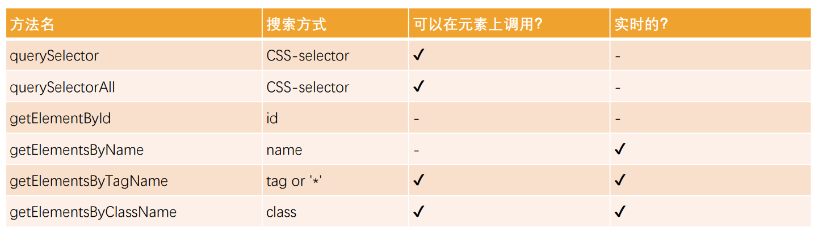
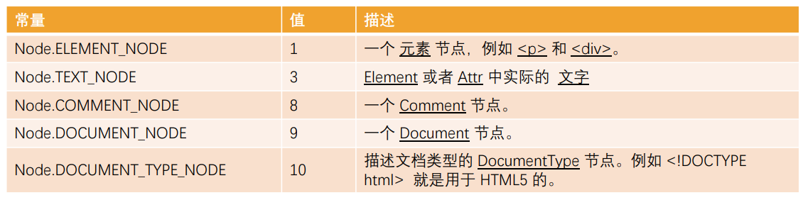

# JavaScript的DOM操作

## DOM的理解

>  DOM：文档对象模型（Document Object Model） 简称 DOM，将页面所有的内容表示为可以修改的对象；
> 浏览器会对我们编写的HTML、CSS进行渲染，同时它又要考虑我们可能会通过JavaScript来对其进行操作：于是浏览器将我们编写在HTML中的每一个元素（Element）都抽象成了一个个对象；
>  所有这些对象都可以通过JavaScript来对其进行访问，那么我们就可以通过JavaScript来操作页面；
> 所以，我们将这个抽象过程称之为 文档对象模型（Document Object Model）；
> 整个文档被抽象到 document 对象中：
> > 比如document.documentElement对应的是html元素；
> > 比如document.body对应的是body元素；
> > 比如document.head对应的是head元素；
> 所以我们学习DOM，就是在学习如何通过JavaScript对文档进行操作的；

## DOM Tree的理解

> 一个页面不只是有html、head、body元素，也包括很多的子元素：
> 在html结构中，最终会形成一个树结构；
> 在抽象成DOM对象的时候，它们也会形成一个树结构，我们称之为DOM Tree；
> DOM相当于是JavaScript和HTML、CSS之间的桥梁
> > 通过浏览器提供给我们的DOM API，我们可以对元素以及其中的内容做任何事情；

## document对象

 > Document节点表示的整个载入的网页，它的实例是全局的document对象：
- 对DOM的所有操作都是从 document 对象开始的；
- 它是DOM的 入口点，可以从document开始去访问任何节点元素；
> 对于最顶层的html、head、body元素，我们可以直接在document对象中获取到：
- html元素：<html> = document.documentElement
- body元素：<body> = document.body
- head元素：<head> = document.head
- 文档声明：<!DOCTYPE html> = document.doctype

## 元素（Element）之间的导航（navigator）

- 如果我们获取到一个元素（Element）后，可以根据这个元素去获取其他的元素，我们称之为元素之间的导航。
- 节点之间存在如下的关系：
- 父元素：parentElement
- 前兄弟节点：previousElementSibling
- 后兄弟节点：nextElementSibling
- 子节点：children
- 第一个子节点：firstElementChild
- 第二个子节点：lastElementChild

## 表格（table）元素的导航

- <table> 元素支持 (除了上面给出的，之外) 以下这些属性：
  - table.rows — <tr> 元素的集合；
  - table.caption/tHead/tFoot — 引用元素 <caption>，<thead>，<tfoot>；
  - table.tBodies — <tbody> 元素的集合；
- <thead>，<tfoot>，<tbody> 元素提供了 rows 属性：
- tbody.rows — 表格内部 <tr> 元素的集合；
- <tr>：
  - tr.cells — 在给定 <tr> 中的 <td> 和 <th> 单元格的集合；
  - tr.sectionRowIndex — 给定的 <tr> 在封闭的 <thead>/<tbody>/<tfoot> 中的位置（索引）；
  - tr.rowIndex — 在整个表格中 <tr> 的编号（包括表格的所有行）；
- <td> 和 <th>：
  - td.cellIndex — 在封闭的 <tr> 中单元格的编号。

## 获取元素的方法

>  目前最常用的是querySelector和querySelectAll；
>  getElementById偶尔也会使用或者在适配一些低版本浏览器时；

### 节点的属性 - nodeType

> nodeType属性：
> > nodeType 属性提供了一种获取节点类型的方法；
> > 它有一个数值型值（numeric value）；
> 常见的节点类型有如下：

### 节点的属性 – nodeName、tagName

- nodeName：获取node节点的名字；
- tagName：获取元素的标签名词；
- tagName 和 nodeName 之间有什么不同呢？
  - tagName 属性仅适用于 Element 节点；
  - nodeName 是为任意 Node 定义的：
    - 对于元素，它的意义与 tagName 相同，所以使用哪一个都是可以的；
    - 对于其他节点类型（text，comment 等），它拥有一个对应节点类型的字符串；

### 节点的属性 - innerHTML、textContent

- innerHTML 属性
  - 将元素中的 HTML 获取为字符串形式；
  - 设置元素中的内容；
- outerHTML 属性
  - 包含了元素的完整 HTML
  - innerHTML 加上元素本身一样；
- textContent 属性
  - 仅仅获取元素中的文本内容；
- innerHTML和textContent的区别：
  - 使用 innerHTML，我们将其“作为 HTML”插入，带有所有 HTML 标签。
  - 使用 textContent，我们将其“作为文本”插入，所有符号（symbol）均按字面意义处理。

**节点的属性 - nodeValue**

- nodeValue/data:用于获取非元素节点的文本内容

- hidden属性：也是一个全局属性，可以用于设置元素隐藏。
- DOM 元素还有其他属性：
  - value
    - <input>，<select> 和 <textarea>（HTMLInputElement，HTMLSelectElement……）的 value。
  - href
    - <a href="...">（HTMLAnchorElement）的 href。
  - id
    - 所有元素（HTMLElement）的 “id” 特性（attribute）的值。

## 元素的属性和特性

> 一个元素除了有开始标签、结束标签、内容之外，还有很多的属性（attribute）,浏览器在解析HTML元素时，会将对应的attribute也创建出来放到对应的元素对象上。

### attribute的分类

- 标准的attribute：某些attribute属性是标准的，比如id、class、href、type、value等；
- 非标准的attribute：某些attribute属性是自定义的，比如abc、age、height等；

### attribute的操作

- 对于所有的attribute访问都支持如下的方法：
  - elem.hasAttribute(name) — 检查特性是否存在。
  - elem.getAttribute(name) — 获取这个特性值。
  - elem.setAttribute(name, value) — 设置这个特性值。
  - elem.removeAttribute(name) — 移除这个特性。
  - attributes：attr对象的集合，具有name、value属性；
- attribute具备以下特征：
  - 它们的名字是大小写不敏感的（id 与 ID 相同）。
  - 它们的值总是字符串类型的。

### 元素的属性（property）

- 对于标准的attribute，会在DOM对象上创建与其对应的property属性：
- 在大多数情况下，它们是相互作用的
  - 改变property，通过attribute获取的值，会随着改变；
  - 通过attribute操作修改，property的值会随着改变；
    - 但是input的value修改只能通过attribute的方法；
- 除非特别情况，大多数情况下，设置、获取attribute，推荐使用property的方式：
  - 这是因为它默认情况下是有类型的；

### HTML5的data-*自定义属性

> HTML5的data-*自定义属性，那么它们也是可以在dataset属性中获取到的：

## JavaScript动态修改样式

- 有时候我们会通过JavaScript来动态修改样式，这个时候我们有两个选择：
  - 选择一：在CSS中编写好对应的样式，动态的添加class；
  - 选择二：动态的修改style属性；
- 开发中如何选择呢？
  - 在大多数情况下，如果可以动态修改class完成某个功能，更推荐使用动态class；
  - 如果对于某些情况，无法通过动态修改class（比如精准修改某个css属性的值），那么就可以修改style属性；

### 元素的className和classList

- 元素的class attribute，对应的property并非叫class，而是className：
  - 这是因为JavaScript早期是不允许使用class这种关键字来作为对象的属性，所以DOM规范使用了className；
  - 虽然现在JavaScript已经没有这样的限制，但是并不推荐，并且依然在使用className这个名称；
- 我们可以对className进行赋值，它会替换整个类中的字符串。
- 如果我们需要添加或者移除单个的class，那么可以使用classList属性。
- elem.classList 是一个特殊的对象：
  - elem.classList.add (class) ：添加一个类
  - elem.classList.remove(class)：添加/移除类。
  - elem.classList.toggle(class) ：如果类不存在就添加类，存在就移除它。
  - elem.classList.contains(class)：检查给定类，返回 true/false。
- classList是可迭代对象，可以通过for of进行遍历。

### 元素的style属性

- 如果需要单独修改某一个CSS属性，那么可以通过style来操作：
  - 对于多词（multi-word）属性，使用驼峰式 camelCase
- 如果我们将值设置为空字符串，那么会使用CSS的默认样式：
- 多个样式的写法，我们需要使用cssText属性：
  - 不推荐这种用法，因为它会替换整个字符串；

### 元素style的读取 - getComputedStyle

- 如果我们需要读取样式：
  - 对于内联样式，是可以通过style.*的方式读取到的;
  - 对于style、css文件中的样式，是读取不到的；
- 这个时候，我们可以通过getComputedStyle的全局函数来实现：

### 创建元素

> document.write 方法写入一个元素：这种方式写起来非常便捷，但是对于复杂的内容、元素关系拼接并不方便；
> 它是在早期没有DOM的时候使用的方案，目前依然被保留了下来；
> 目前我们插入一个元素，通常会按照如下步骤：
> > 步骤一：创建一个元素；document.createElement(tag)
> > 步骤二：插入元素到DOM的某一个位置；
>  - node.append(...nodes or strings) —— 在 node 末尾 插入节点>或字符串，
>  - node.prepend(...nodes or strings) —— 在 node 开头 插入节>点或  字符串，
>  - node.before(...nodes or strings) —— 在 node 前面 插入节点>或字  符串，
>  - node.after(...nodes or strings) —— 在 node 后面 插入节点>或字  符串，
>  - node.replaceWith(...nodes or strings) —— 将 node 替换为给>定的  节点或字符串。

### 移除和克隆元素

> 移除元素我们可以调用元素本身的remove方法：
> 如果想要复制一个**现有**的元素，可以通过cloneNode方法：
> > 可以传入一个Boolean类型的值，来决定是否是深度克隆；
> > 深度克隆会克隆对应元素的**子元素**，否则不会；

#### 旧的元素操作方法

-  parentElem.appendChild(node)：
  - 在parentElem的父元素最后位置添加一个子元素
-  parentElem.insertBefore(node, nextSibling)：
  - 在parentElem的nextSibling前面插入一个子元素；
-  parentElem.replaceChild(node, oldChild)：
  - 在parentElem中，新元素替换之前的oldChild元素；
-  parentElem.removeChild(node)：
  - 在parentElem中，移除某一个元素；

### 元素的大小、滚动

- clientWidth：contentWith+padding（不包含滚动条）
- clientHeight：contentHeight+padding
- clientTop：border-top的宽度
- clientLeft：border-left的宽度
- offsetWidth：元素完整的宽度
- offsetHeight：元素完整的高度
- offsetLeft：距离父元素的x
- offsetHeight：距离父元素的y
- scrollHeight：整个可滚动的区域高度
- scrollTop：滚动部分的高度

### window的大小、滚动

- window的width和height
  - innerWidth、innerHeight：获取window窗口的宽度和高度（包含滚动条）
  - outerWidth、outerHeight：获取window窗口的整个宽度和高度（包括调试工具、工具栏）
  - documentElement.clientHeight、documentElement.clientWidth：获取html的宽度和高度（不包含滚动条）
- window的滚动位置：
  - scrollX：X轴滚动的位置（别名pageXOffset）
  - scrollY：Y轴滚动的位置（别名pageYOffset）
- 也有提供对应的滚动方法：
  - 方法 scrollBy(x,y) ：将页面滚动至 相对于当前位置的 (x, y) 位置；
  - 方法 scrollTo(pageX,pageY) 将页面滚动至 绝对坐标；

## JavaScript的事件处理

### 事件

> Web页面需要经常和用户之间进行交互，而交互的过程中我们可能想要捕捉这个交互的过程：
> 
>  比如用户点击了某个按钮、用户在输入框里面输入了某个文本、用户鼠标经过了某个位置；
> 
> 浏览器需要搭建一条JavaScript代码和事件之间的桥梁；
> 
> 当某个事件发生时，让JavaScript可以相应（执行某个函数），所以我们需要针对事件编写处理程序（handler）；

- 如何进行事件监听
  - 事件监听方式一：在script中直接监听（很少使用）；
  - 事件监听方式二：DOM属性，通过元素的on来监听事件；
  - 事件监听方式三：通过EventTarget中的addEventListener来监听；

### 常见的事件列表
- 鼠标事件：
  - click —— 当鼠标点击一个元素时（触摸屏设备会在点击时生成）。
  - mouseover / mouseout —— 当鼠标指针移入/离开一个元素时。
  - mousedown / mouseup —— 当在元素上按下/释放鼠标按钮时。
  - mousemove —— 当鼠标移动时。

- 键盘事件：
  - keydown 和 keyup —— 当按下和松开一个按键时。

- 表单（form）元素事件：
  - submit —— 当访问者提交了一个 <form> 时。
  - focus —— 当访问者聚焦于一个元素时，例如聚焦于一个 <input>。
  
- Document 事件：
  - DOMContentLoaded —— 当 HTML 的加载和处理均完成，DOM 被完全构建完成时。
  
- CSS 事件：
  - transitionend —— 当一个 CSS 动画完成时。

### 认识事件流

**事实上对于事件有一个概念叫做事件流，为什么会产生事件流呢？**
- 我们可以想到一个问题：当我们在浏览器上对着一个元素点击时，你点击的不仅仅是这个元素本身；
- 这是因为我们的HTML元素是存在父子元素叠加层级的；
- 比如一个span元素是放在div元素上的，div元素是放在body元素上的，body元素是放在html元素上的；

#### 事件冒泡和事件捕获

- 默认情况下事件是从最内层的span向外依次传递的顺序，这个顺序我们称之为事件冒泡（Event Bubble）;
- 还有另外一种监听事件流的方式就是从外层到内层（body -> span），这种称之为事件捕获（Event Capture）；
  
**产生两种不同的处理流的原因**

- 早期浏览器开发时，不管是IE还是Netscape公司都发现了这个问题;
- 但是他们采用了完全相反的事件流来对事件进行了传递；
- IE采用了事件冒泡的方式，Netscape采用了事件捕获的方式；

**事件捕获和冒泡的过程**

- 捕获阶段（Capturing phase）：
  - 事件（从 Window）向下走近元素。
- 目标阶段（Target phase）：
  - 事件到达目标元素。
- 冒泡阶段（Bubbling phase）：
  - 事件从元素上开始冒泡。
  
> 开发中通常会使用事件冒泡

### 事件对象

- 当一个事件发生时，就会有和这个事件相关的很多信息：
  - 比如事件的类型是什么，你点击的是哪一个元素，点击的位置是哪里等等相关的信息；
  - 那么这些信息会被封装到一个Event对象中，这个对象由浏览器创建，称之为event对象；
  - 该对象给我们提供了想要的一些属性，以及可以通过该对象进行某些操作；
- 如何获取这个event对象呢？
  - event对象会在传入的事件处理（event handler）函数回调时，被系统传入；
  - 我们可以在回调函数中拿到这个event对象；

### event常见的属性和方法

- type：事件的类型；
- target：当前事件发生的元素；
- currentTarget：当前处理事件的元素；
- eventPhase：事件所处的阶段；
- offsetX、offsetY：事件发生在元素内的位置；
- clientX、clientY：事件发生在客户端内的位置；
- pageX、pageY：事件发生在客户端相对于document的位置；
- screenX、screenY：事件发生相对于屏幕的位置；

- 常见的方法：
  - preventDefault：取消事件的默认行为；
  - stopPropagation：阻止事件的进一步传递（冒泡或者捕获都可以阻止）；

### 事件处理中的this

- 在函数中，我们也可以通过this来获取当前的发生元素：
- 这是因为在浏览器内部，调用event handler是绑定到当前的target上的

### EventTarget类

- 我们会发现，所有的节点、元素都继承自EventTarget
  - 事实上Window也继承自EventTarget；
- 那么这个EventTarget是什么呢？
  - EventTarget是一个DOM接口，主要用于添加、删除、派发Event事件；
- EventTarget常见的方法：
  - addEventListener：注册某个事件类型以及事件处理函数；
  - removeEventListener：移除某个事件类型以及事件处理函数；
  - dispatchEvent：派发某个事件类型到EventTarget上；

### 事件委托（event delegation）

> 事件冒泡在某种情况下可以帮助我们实现强大的事件处理模式 – 事件委托模式（也是一种设计模式）
- 那么这个模式是怎么样的呢？
  - 因为当子元素被点击时，父元素可以通过冒泡可以监听到子元素的点击；
  - 并且可以通过event.target获取到当前监听的元素；

### 事件委托的标记

> 某些事件委托可能需要对具体的子组件进行区分，这个时候我们可以使用data-*对其进行标记：

### 常见的鼠标事件

- click 当用户点击某个对象时调用的事件句柄。
- contextmenu 在用户点击鼠标右键打开上下文菜单时触发
- dblclick 当用户双击某个对象时调用的事件句柄。
- mousedown 鼠标按钮被按下。
- mouseup 鼠标按键被松开。
- mouseover 鼠标移到某元素之上。（支持冒泡）
- mouseout 鼠标从某元素移开。（支持冒泡）
- mouseenter 当鼠标指针移动到元素上时触发。（不支持冒泡）
- mouseleave 当鼠标指针移出元素时触发。（不支持冒泡）
- mousemove 鼠标被移动

### 常见的键盘事件

- onkeydown 某个键盘按键被按下。
- onkeypress 某个键盘按键被按下。
- onkeyup 某个键盘按键被松开。

- 事件的执行顺序是 onkeydown、onkeypress、onkeyup
  - down事件先发生；
  - press发生在文本被输入；
  - up发生在文本输入完成；
  
- 可以通过key和code来区分按下的键：
  - code：“按键代码”（"KeyA"，"ArrowLeft" 等），特定于键盘上按键的物理位置。
  - key：字符（"A"，"a" 等），对于非字符（non-character）的按键，通常具有与 code 相同的值。）

### 常见的表单事件

|属性|描述|
|---|---|
|onchange| 该事件在表单元素的内容改变时触发`( <input>, <keygen>, <select>, 和 <textarea>)`|
|oninput |元素获取用户输入时触发|
|onfocus| 元素获取焦点时触发|
|onblur |元素失去焦点时触发|
|onreset |表单重置时触发|
|onsubmit| 表单提交时触发|

### 文档加载事件

- DOMContentLoaded：浏览器已完全加载 HTML，并构建了 DOM 树，但像  和样式表之类的外部资源可能尚未加载
完成。
- load：浏览器不仅加载完成了 HTML，还加载完成了所有外部资源：图片，样式等。

## window定时器方法

> 有时我们并不想立即执行一个函数，而是等待特定一段时间之后再执行，我们称之为“计划调用（scheduling a call）”
> 
> 有两种方式可以实现：
> > setTimeout 允许我们将函数推迟到一段时间间隔之后再执行。
> > setInterval 允许我们重复运行一个函数，从一段时间间隔之后开始运行，之后以该时间间隔连续重复运行该函数。
> 
> 通常情况下对应的取消方法：
> > clearTimeout：取消setTimeout的定时器；
> > clearInterval：取消setInterval的定时器；

#### setTimeout的使用

- setTimeout的语法如下：
`let timeId = setTimeout(function[code,[delay],[arg1],[arg2],..]}`)
- func|code：想要执行的函数或代码字符串。
  - 一般传入的都是函数，由于某些历史原因，支持传入代码字符串，但是不建议这样做；
  - delay：执行前的延时，以毫秒为单位（1000 毫秒 = 1 秒），默认值是 0；
- arg1，arg2…：要传入被执行函数（或代码字符串）的参数列表；
- clearTimeout方法：
  - setTimeout 在调用时会返回一个“定时器标识符（timer identifier）”，我们可以使用它来取消执行。

#### setInterval的使用

- setInterval 方法和 setTimeout 的语法相同：
`let timeId = setInterval(function[code,[delay],[arg1],[arg2],..]}`)
- 不过与 setTimeout 只执行一次不同，setInterval 是每间隔给定的时间周期性执行；
- clearInterval方法：
  - setInterval也会返回一个“定时器标识符（timer identifier）”，我们可以通过clearInterval来取消这个定时器。