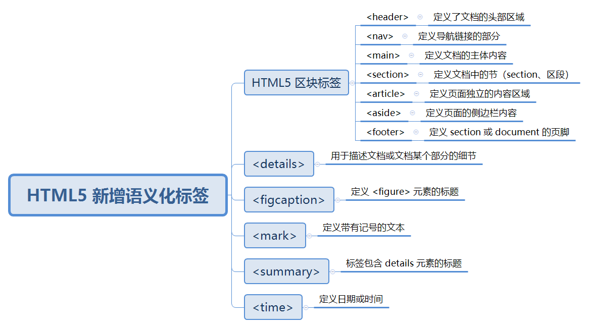
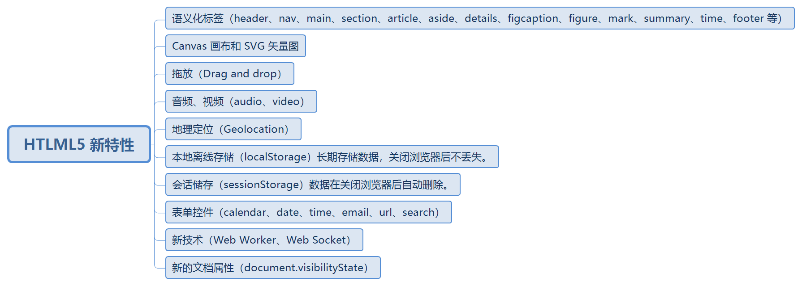
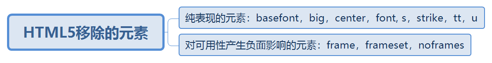

# 面试题库

## 一、如何做面试题？

> 第一步、总结出题目考点
> 
> 第二步、整理考点
> 
> 第三步、进行解答

## 二、HTML/HTML5相关面试题

### 1、什么时html语义化，谈谈你的理解？HTML5新增语义化标签有哪些？

> html语义化是指html文档中有英文语义的标签，比如 `<p>、<from>、<table>`等。
> 
>  目的是：
> 
> 1、方便开发人员的开发和阅读，由W3C组织制定的语义化标签，有助于各过开发人员的相互阅读网页结构。
> 
> 2、提升SEO优化，方便搜索引擎的解读，和爬虫信息的爬取，而爬虫原理就是依赖标签来确定上下文和关键词的权重。
> 
> 3、有利于有阅读障碍的用户更好的阅读，标签语义化利于浏览器为相关需求的用户进行解读。
> 方便维护，标签的语义化更具可读性，减少网页差距，方便再次开发和维护。

书写html时，如何注重语义化？

> 1、尽量少使用无语义的标签，比如 `<div>、<span>`标签。
> 
> 2、对于`<div>`和`<p>`优先考虑p标签，有利于特殊终端的兼容。
> 
> 3、尽可能使用css确定网页元素的样式
> 
> 4、强调文本时优先考虑`<strong>`和`<em>`标签。
> 5、使用表格时，标题要用 caption，表头用 thead，主体部分用 tbody 包围，尾部用 tfoot 包围。表头和一般单元格要区分开，表头用 th，单元格用 td；
> 6、表单域用fieldset 标签包起来，并用 legend 标签说明表单的用途
> 
> 7、每个 input 标签对应的说明文本都需要使用 label 标签，并且通过为 input 设置 id 属性，在 lable 标签中设置 for=someld 来让说明文本和相对应的 input 关联起来。
> 
> 8、不但标签要语义化，在css和js等取名时也应该尽可能的语义化，最好使用有语义化的英文。

HTML5新增语义化标签有哪些？



### 2、DOCTYPE 的作用，都有哪些属性

> DOCTYPE 是 document type (文档类型) 的缩写。声明位于文档的最前面,不是html标签。
> 
> 作用：告诉浏览器的解析器使用哪种 HTML 规范或者 XHTML 规范来解析页面。
> 目的：防止浏览器在渲染文档时，进入“怪异模式渲染”。确保浏览器按照标准模式进行渲染，而不是使用一个不符合规范的渲染模式。
> 目前使用HTML5,只有一种可用的 DOCTYPE 声明

```html
<!DOCTYPE html>
```

### 3、meta标签的作用及其属性

> `<meta>`标签是描述HTML网页的元信息，在页面上是不会显示，主要是给机器读的，告诉机器如何解析页面。
> 主要属性有：
> 
> charset：规定 HTML 页面的字符编码
> 
> content：当 meta 标签中有http-equiv或name属性的时候，一定要有 content 属性对其进行说明。
> 
> http-equiv：添加 http 头部内容对一些自定义的，或者需要额外添加的 http 头部内容，需要发送到浏览器中
> 
> name：元数据的名称

### 4、HTLML5 新特性



