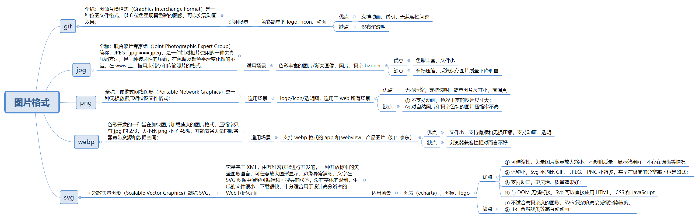

# 面试题库

## 一、如何做面试题？

> 第一步、总结出题目考点
> 
> 第二步、整理考点
> 
> 第三步、进行解答

## 二、HTML/HTML5相关面试题

### 1、什么时html语义化，谈谈你的理解？HTML5新增语义化标签有哪些？

> html语义化是指html文档中有英文语义的标签，比如 `<p>、<from>、<table>`等。
> 
>  目的是：
> 
> 1、方便开发人员的开发和阅读，由W3C组织制定的语义化标签，有助于各过开发人员的相互阅读网页结构。
> 
> 2、提升SEO优化，方便搜索引擎的解读，和爬虫信息的爬取，而爬虫原理就是依赖标签来确定上下文和关键词的权重。
> 
> 3、有利于有阅读障碍的用户更好的阅读，标签语义化利于浏览器为相关需求的用户进行解读。
> 方便维护，标签的语义化更具可读性，减少网页差距，方便再次开发和维护。

书写html时，如何注重语义化？

> 1、尽量少使用无语义的标签，比如 `<div>、<span>`标签。
> 
> 2、对于`<div>`和`<p>`优先考虑p标签，有利于特殊终端的兼容。
> 
> 3、尽可能使用css确定网页元素的样式
> 
> 4、强调文本时优先考虑`<strong>`和`<em>`标签。
> 5、使用表格时，标题要用 caption，表头用 thead，主体部分用 tbody 包围，尾部用 tfoot 包围。表头和一般单元格要区分开，表头用 th，单元格用 td；
> 6、表单域用fieldset 标签包起来，并用 legend 标签说明表单的用途
> 
> 7、每个 input 标签对应的说明文本都需要使用 label 标签，并且通过为 input 设置 id 属性，在 lable 标签中设置 for=someld 来让说明文本和相对应的 input 关联起来。
> 
> 8、不但标签要语义化，在css和js等取名时也应该尽可能的语义化，最好使用有语义化的英文。

HTML5新增语义化标签有哪些？


### 2、DOCTYPE 的作用，都有哪些属性

> DOCTYPE 是 document type (文档类型) 的缩写。声明位于文档的最前面,不是html标签。
> 
> 作用：告诉浏览器的解析器使用哪种 HTML 规范或者 XHTML 规范来解析页面。
> 目的：防止浏览器在渲染文档时，进入“怪异模式渲染”。确保浏览器按照标准模式进行渲染，而不是使用一个不符合规范的渲染模式。
> 目前使用HTML5,只有一种可用的 DOCTYPE 声明

```html
<!DOCTYPE html>
```

### 3、meta标签的作用及其属性

> `<meta>`标签是描述HTML网页的元信息，在页面上是不会显示，主要是给机器读的，告诉机器如何解析页面。
> 主要属性有：
> 
> charset：规定 HTML 页面的字符编码
> 
> content：当 meta 标签中有http-equiv或name属性的时候，一定要有 content 属性对其进行说明。
> 
> http-equiv：添加 http 头部内容对一些自定义的，或者需要额外添加的 http 头部内容，需要发送到浏览器中
> 
> name：元数据的名称

### 4、HTLML5 新特性


### 5、form 表单的属性

> 表单用于收集用户信息
> 通过设置 form 标签的属性值以及为它添加子元素，上传数据和与服务器进行通讯交互。


### 6、href 和 src 的区别

> href 用于建立当前页面与引用资源之间的关系，而 src 会替换当前元素。
>
> 遇到 href，页面会并行加载后续内容，而 src 则需要浏览器加载完毕 src 的内容才会继续往下走。

> src 是 source 的缩写，指向外部资源的位置
> > 指向的内容将会嵌入到文档中当前标签所在位置或下载并应用到文档内；如 js 脚本，img 图片和 iframe 等元素。
> > 当浏览器解析到该元素时，会暂停其他资源的下载和处理，直到将该资源加载、编译、执行完毕.类似于将所指向资源嵌入当前标签内,因此 js 脚本放在底部而不是头部。

> href 是 Hypertext Reference 的缩写，指向网络资源所在位置
> > 建立和当前元素（锚点）或当前文档（链接）之间的链接

### 7、不同图片格式的区别



> 图片格式:
> 大小 PNG与JPG大小相近大于GIF。
> 色彩丰富度：JPG>PNG>GIF
> 兼容性：GIF>JPG>PNG

### 8、精灵图的原理和优缺点

> 精灵图是为了减少网络亲求，将多张小图融合到一张图上，通过css的backgroud-position或者img的clip通过定位显示要呈现的图片部位。
> 
> 优点：减少加载网页时图片对服务器的请求次数，提高页面性能，减少图片的字节。
> 缺点：灵活的小，维护困难。
> 
> 多用于图标。

### 9、什么时Canvas？

> Canvas是画布，通过JavaScript绘制2D图形，是逐像素进行渲染的。当图形绘制完成后，浏览器就不会继续关注。当位置发生变化时，整个场景将重新绘制。
> 
> 特点：
> > 依赖分辨率
> > 逐像素进行渲染
> > 弱文本渲染能力
> > 不支持事件处理器
> > 弱的文本感染力
> > 结果图像能保存png和jpg格式
> > 适合图像密集型的游戏，其中的许多对象会被频繁重绘

Canvas使用场景

> 游戏,流行的游戏引擎 cocos2d-js、Egret 都基于 html5 的 canvas.
> 图表制作
> banner 广告
> 模拟器
> 远程计算机控制,Canvas 可以让开发者更好地实现基于 Web 的数据传输，构建一个完美的可视化控制界面。
> 字体设计
> 图形编辑器
> 其他可嵌入网站的内容：类似图表、音频、视频,还有许多元素能够更好地与 Web 融合，并且不需要任何插件。

### 10、Canvas 和 SVG的区别

| Canvas | SVG |
|:---: | :---:|
| 由JavaScript绘制| XML的2d语言|
| 取决于分辨率 | 独立于分辨率 |
| 不支持事件处理程序| 支持事件处理程序|
|适用小规模渲染应用程序| 在大规模渲染应用程序中表现更好|
| 适合图像密集型的游戏，其中的许多对象会被频繁重绘| 不适合游戏应用，复杂度高会减慢渲染速度|

> 适用范围：
> > Canvas 是逐像素进行渲染,而 SVG 是通过 DOM 操作来显示的。
> > Canvas 的文本渲染能力弱，而 SVG 适合带有大型渲染区域的应用程序。
> > Canvas 最适合有许多对象要被频繁重绘的图形密集型游戏。
> > SVG 由于 DOM 操作 在复杂度高的游戏应用中 会减慢渲染速度。所以不适合在游戏应用。

### 11、HTML5的优势

> 它有多媒体支持。
> 
> 它具有使用 SQL 数据库和应用程序缓存存储离线数据的能力。
> 
> avascript 可以在后台运行。
> 
> HTML5 允许用户绘制各种形状，如矩形、圆形、三角形等。
> 
> 包括新的语义标签和表单控制标签。

### 12、HTML5 规范的重要目标是什么 ？

> 引入新元素标签以更好地构建网页
> 形成跨浏览器行为的标准并支持不同的设备和平台
> 向后兼容旧版本的 HTML 网页
> 引入基本交互元素，不依赖 <video> 标签等插件，和 flash 插件。

### 13、旧浏览器如何支持 SVG？

> 为了支持旧浏览器而不是在  标签的 src 属性中定义 svg 的资源应该在 srcset 属性中定义它，并且应该在 src 中定义备用 png 文件。
```html

```

### 14、HTML5 中的内联元素和块级元素

> 内联元素只占用内容绝对必要的空间，而不是从新行开始。 如：`<span>、<a>、<strong>、、<button>、<em>、<select>、<abbr>、<label>、<sub>、<cite>、<abbr> 、<script>、<label>、<i>、<input>、<output>、<q>` 等。

> 块元素从新行开始并占用可用页面的整个宽度。 比如：`<div>、<p>、<header>、<footer>、<h1>...<h6>、<form>、<table>、<canvas>、<video>、<blockquote>、< pre>、<ul>、<ol>、<figcaption>、<figure>、<hr>、<article>、<section>`等。
